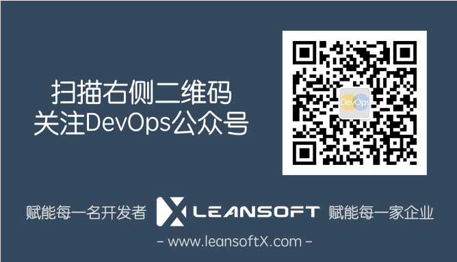

# Azure DevOps 101 培训及动手实验文档集

本Repo包含leansoftX.com对外提供的基于微软研发云(Azure DevOps)的培训级动手实验文档集合，本文档集免费开源提供给社区使用，您可以任意复制，修改并在任何非商业性用途中使用。

文档源代码托管于Github https://github.com/leansoftX/azure-devops-101

## 文档入口

您可以直接在GitHub浏览本文档或者通过[【DevOps文档中心】](https://docs.devopshub.cn)查看

* [Github文档入口](src/index.md)
* [DevOps文档中心入口](https://docs.devopshub.cn/mdwiki/#!docs/azure-devops-101/index.md)

所有文档使用markdown格式编写，并使用Azure DevOps Pipeline（流水线）自动发布

## 欢迎参与文档编写

欢迎任何人通过Fork + Pull Reqeust或者Issue的方式提交本文档相关的任何问题，Bug和特定内容的请求，我们即使处理您的请求。

## 版权和帮助

如果您在使用此文档的过程中遇到任何问题，请扫描以下二维码关注我公司公众号，并通过留言的方式与我们取得联系，我们会在第一时间回复您的问题。

本文档内容由[leansoftX.com](https://leansoftX.com)提供并拥有版权，访问者可将本文档提供的内容或服务用于个人学习、研究或欣赏，以及其他非商业性或非盈利性用途，但同时应遵守著作权法及其他相关法律的规定，不得侵犯本文档及相关权利人的合法权利。除此以外，将本文档任何内容或服务用于其他用途时，须征得LEANSOFT的书面许可，并支付报酬。

版权所有(c)英捷创软科技(北京)有限公司
[leansoftX.com](https://leansoftX.com)