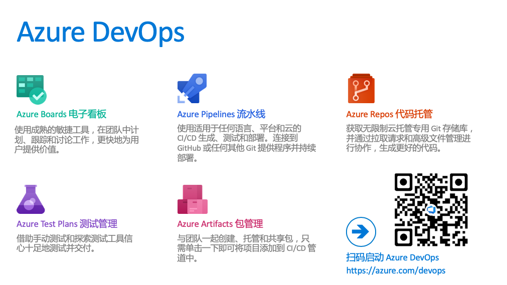
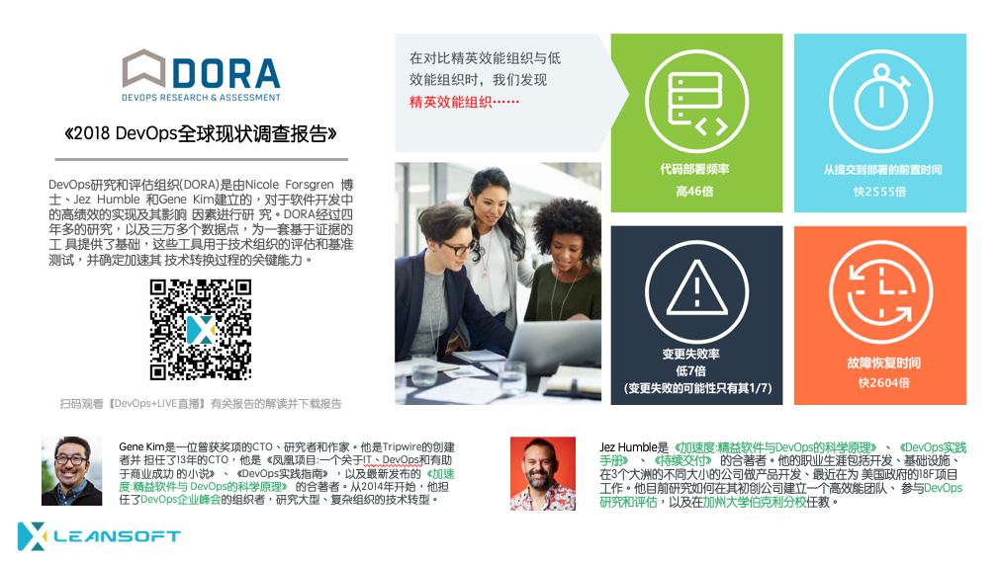
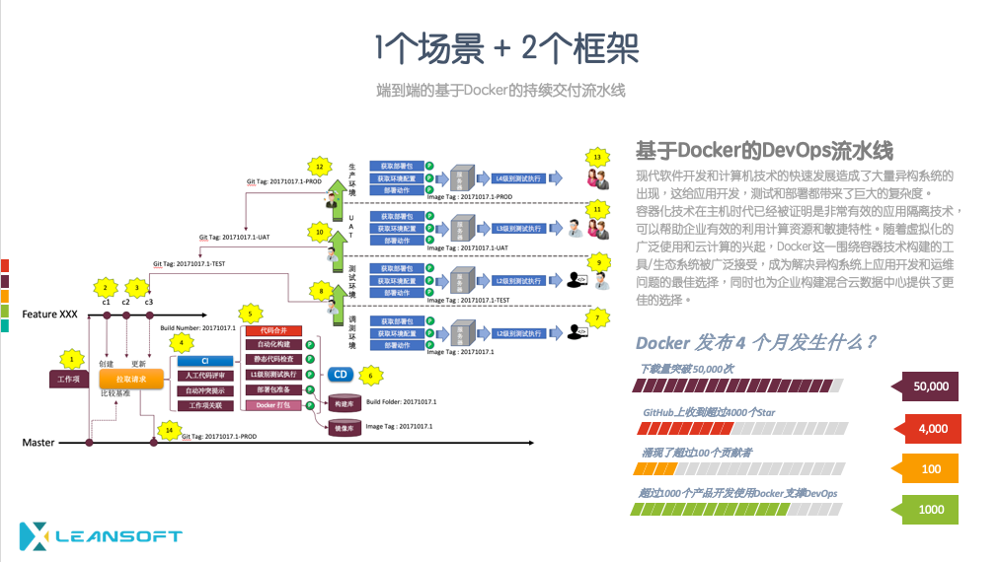
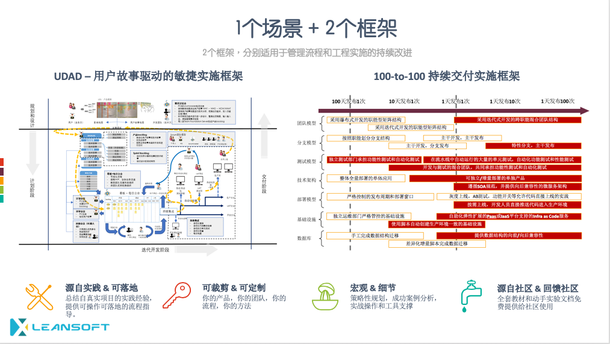
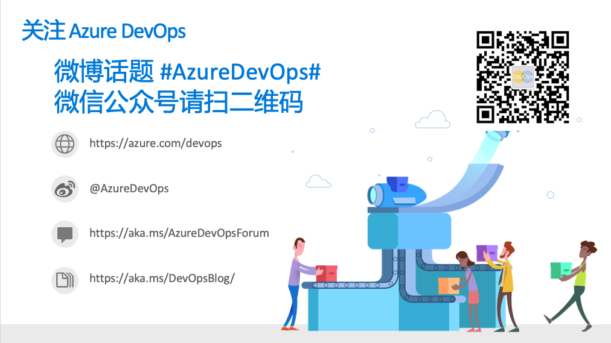
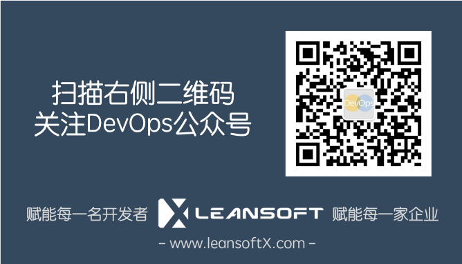

# Azure DevOps 101 微软研发云培训及动手实验文档集

今天的技术常新日新月异，数字化转型给全球各行业都带来了去打的变革和机遇，今天任何一家公司都必须成为软件公司，通过科技的提升才能赢得未来。面对市场和技术的快速发展，实现快速迭代，敏捷开发和DevOps研发运维一体化，已经成为软件工程领域的主流趋势。在实际推动DevOps实践的过程中，无论是快速成长的新创企业，或是拥有大规模IT团队的大型企业，我们都常听到这种问题：为什么要DevOps？DevOps能解决哪些问题？导入DevOps有哪些挑战，方法和步骤？如何让DevOps实践为企业创造价值？

面对这些问题，我们的答案是“微软研发云”。微软研发云是支撑微软全球六万名软件工程师的DevOps平台，使用Azure DevOps以及微软云所提供的DevTest Lab实验室，监控，部署和移动应用测试等云服务。微软研发云为企业开发和运维团队顺畅对接提供了端到端的研发管理，配置管理，持续集成，持续部署，持续监控和持续改进能力。微软研发云支持所有主流编程语言和平台，包括：C#, Java, Python, Node.js, PHP, Object-C等；同时也支持云应用，桌面，网页，移动设备，物联网与人工智能等应用项目开发。微软研发云在全球已经有了几百万名用户，基于Azure DevOps的功能，我们也提供企业本地化部署的Azure DevOps Server (TFS)，让私有云和企业用户也能获益于微软DevOps工具链。

本课程由 leansoftX.com 推出，为管理者和开发者提供理论+实践的微软研发云全面功能讲解，配合丰富细致的教材和游戏引导学员一步步完成使用微软研发云构建自己的DevOps工具链的过程。同时，我们还将leansoftX.com丰富的DevOps咨询服务经验，为您提供实用的解决方案规划指导。

## Azure DevOps 简介

微软将 Azure Boards 电子看板、Azure Pipelines 流水线、Azure Test Plans 测试管理、Azure Artifacts 包管理、Azure Lab Services 实验室服务、Azure Repos 代码托管服务等六项服务整合为全新的 Azure DevOps 研发云服务，为开发者团队提供了全面覆盖计划、创建、编程、测试、部署、发布、托管、共享等各个环节，适用于任何语言、平台，并且能够与 GitHub 或者其它云平台对接部署的全套开发运维服务。

## DevOps 简介

DORA 公司 （DevOps Research and Assessment，DevOps 研究与评估机构）从 2014 年起每年都会发布一份 DevOps 现状调查报告。在过去五年里，全球有超过30,000名专业技术人员参与了这项调查，其目的是通过数据驱动的研究方法，分析和理解高效能组织背后的管理和技术实践，并帮助团队了解自身在行业中所处的位置，从而科学地量身定制适合团队自身的改进策略，最终成为高效能组织。

在2018年的《全球DevOps现状调查报告》中我们看到精英效能组织能够以高于低效组织46倍的速度发布软件，同时保证低于对方7倍的变更失败率。正是这样高效的IT运作能力吸引了大量组织开始投入DevOps的实践运动。

* 您可以点击这里下载完整版的《2018全球DevOps现状调查报告》
* 或者也可以点击[DevOps+LIVE直播频道](http://devopslive.bopoda.cn/live/63db3130)观看DevOpsDays的核心组织者对这份报告的解读分享视频。

## 课程结构

为了帮助广大企业和开发者快速掌握使用微软研发云(Azure DevOps)实现DevOps转型，leansoftX.com的专家顾问团队整合了多年的实施经验和来自上百家不同类型，规模和行业的组织的软件研发管理和工程经验，整理出以下DevOps实施规划。本课程将以这套方法论为主线，带领您了解实施DevOps的完整路线图。

## 课程大纲

本系列课程提供多种类型的大纲可选，适合不同类型和层次的人员参与。

## 动手实验列表

**准备：Azure DevOps实验环境激活**

* 使用 devcloudX.com 激活 Azure DevOps 实验环境

**第一天：使用Azure DevOps支持敏捷开发实践**

* [实验 1: 了解敏捷开发基本概念](labs/labs01-agile-overview/index.md)
  * [练习 1: 关于用户故事](labs/labs01-agile-overview/01-user-story/index.md)
  * [练习 2: 关于敏捷开发](labs/labs01-agile-overview/02-agile-software-development/index.md)
  * [练习 3: 影响地图概述](labs/labs01-agile-overview/03-impact-mapping/index.md)
  * [练习 4: 用户故事地图概述](labs/labs01-agile-overview/04-user-story-mapping/index.md)
* 实验 2: 销售额翻倍挑战
  * 练习 1: 熟悉示例项目，PartsUnlimited 电子商务网站
  * 练习 2: 使用影响地图和用户故事地图完成目标挑战：销售额翻倍
* 实验 3: 使用Azure DevOps Board电子看板实现影响地图和用户故事地图的电子化管理
  * 练习 1: 管理产品积压工作列表(Product Backlogs)
  * 练习 2: 管理迭代计划(Sprint Backlogs)
  * 练习 3: 电子看板定制化配置
  * 练习 4: 使用电子看板运作一个迭代

**第二天：使用Azure DevOps搭建基于Docker的持续交付流水线**

* 实验 1: 基于Docker的持续交付流水线搭建
  * 练习 1: 从Github导入源代码到Azure DevOps Repo代码托管
  * 练习 2: 使用 Azure DevOps Pipeline流水线完成持续集成配置（生成定义）
  * 练习 3: 使用 Azure DevOps Pipeline流水线完成持续部署配置（发布定义）
* 实验 2: 使用【特性分支+拉取请求+质量门】的方式完成软件质量控制
  * 练习 1: 启用分支策略
  * 练习 2: 创建功能分支并使用拉去请求完成质量验证
  * 练习 3: 完成拉取请求以便合并代码到master分支

## 欢迎参与文档编写

欢迎任何人通过Fork + Pull Reqeust或者Issue的方式提交本文档相关的任何问题，Bug和特定内容的请求，我们即使处理您的请求。

您也可以通过下图所列出的方式与我们取得联系

## 版权和帮助

如果您在使用此文档的过程中遇到任何问题，请扫描以下二维码关注我公司公众号，并通过留言的方式与我们取得联系，我们会在第一时间回复您的问题。

本文档内容由[leansoftX.com](https://leansoftX.com)提供并拥有版权，访问者可将本文档提供的内容或服务用于个人学习、研究或欣赏，以及其他非商业性或非盈利性用途，但同时应遵守著作权法及其他相关法律的规定，不得侵犯本文档及相关权利人的合法权利。除此以外，将本文档任何内容或服务用于其他用途时，须征得LEANSOFT的书面许可，并支付报酬。

版权所有(c)英捷创软科技(北京)有限公司
[leansoftX.com](https://leansoftX.com)