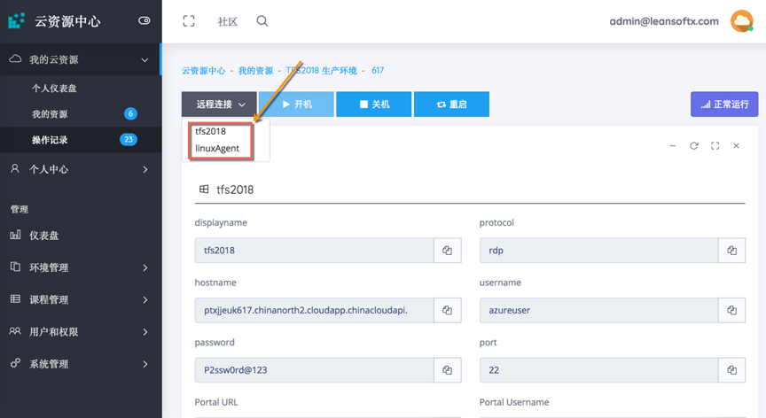
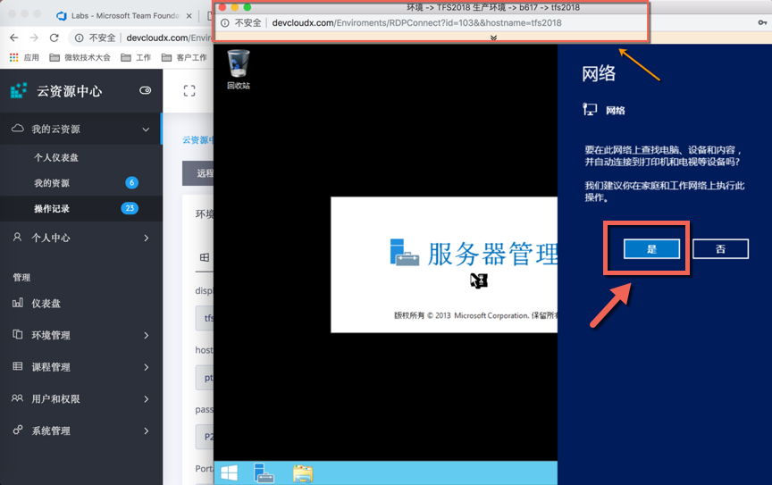
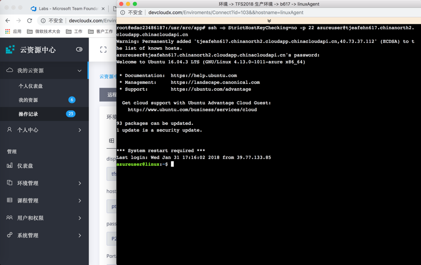

# Azure DevOps试用环境激活指南
## 激活试用环境
### 1. 打开DevOps实验室个人用户注册页面
- [个人注册页面 ](https://devcloudx.com/auth/Register/Personal?ClientId=labs&PostBackUrl=http%3A%2F%2Fdevcloudx.com%2Fapi%2Fuser&ClientLoginUrl=http%3A%2F%2Fdevcloudx.com%2Fusers%2Flogin)

### 2. 注册个人用户,点击注册

### 3. 输入账号密码点击登录

### 4. 选择“TFS生产环境“ – 点击“立即获取”

### 5. 输入邮件里提供给您的邀请码，点击“立即获取”

### 6. 点击“获取”

### 7. 点击“立即创建环境”

### 8. 环境创建中，如下图所示（环境创建大概需要5分钟左右完成，请耐心等待）

### 9. 创建完成后，点击“进入”

### 10. 点击下面菜单可以进行环境管理

### 11. 通过点击以下链接可以分别进入TFS 服务器以及Linux代理服务器

### 12. TFS服务器进入后，选中网络配置“是”，如下图所示

### 13. Linux服务器进入后，如下图所示：

##### 恭喜您，您的环境已激活并可用了！接下来创建一个新的Azure DevOps项目。

## 创建Azure DevOps 项目

### 1. 点击TFS服务器黄色小尖头

### 2. 点击tfs，打开tfs站点门户

### 3. 输入Azure DevOps Server账号密码（默认账号:azureuser,默认密码: P2ssw0rd@123）

### 4. 输入项目项目名称 “Voting”，保持默认版本控制”Git”, 点击创建
##### 注意：由于环境刚刚启动成功，第一次可能会出现项目创建失败的可能，如出现失败，请重新创建, 错误如下所示：

### 5. 项目创建完成，如下图所示：

#### 恭喜，您已经成功的创建了一个Azure DevOps项目！