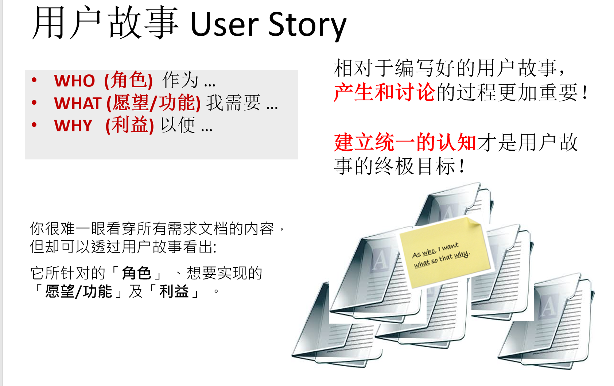

# 用户故事

用户故事可以帮助开发团队从用户的角度来理解需求，同时在交付的过程中按照用户可用的场景进行交付，确保了开发团队可以持续的交付用户关心的功能。但是在实际开发中，团队往往不知道如何入手。

## 如何用好用户故事需要解决几个关键问题

- 如何产生用户故事，让用户将故事讲清楚？
- 如何将用户故事的内容原汁原味的传递给开发团队？
- 如何将用户故事中的内容转换为开发功能点，识别与其他功能点的依赖，形成详细的产品规格？
- 如何在使用用户故事进行增量开发的过程中保持架构的稳定性？同时驱动架构的优化和演进。
- 如何在开发过程中按照故事进行交付，协同开发，测试，架构以及UI/UE等团队？
- 如何使用各种开发工具和平台，借助如任务跟踪，分支计划，持续集成，持续发布，自动化测试等工具让开发过程变得更加高效？

用户故事的需求整理方式与传统需求的整理方式有很大的不同，传统软件开发中我们依赖用户需求，技术需求，规格说明书等工具试图使用规范的文档来解决需求收集和传递的问题。在这个过程中，我们将用户的需求转换成技术可以理解并可实施的规格。对于已经习惯了这种方式的人来说，要转换成使用用户故事的方式需要比较大的思维方式转变，大家往往遇到的疑问也是，难道使用用户故事就不需要规格了吗？其实不然，首先我们要了解用户故事到底是什么。

## 用户故事到底是什么

大家可能觉得既然我们使用用户故事来替代传统需求，那么用户故事就是记录需求的方式了。其实，用户故事不是用来编写的，而是用来讨论和跟踪的。

- 使用用户故事，我们的目的是让用户可以自然的讲述需求，这样才能确保信息的真实性。因为任何软件产品都是为了帮助用户完成某种任务，可以说任何的软件产品或者系统都是通过交互来解决问题的，而交互的双方可能是人和系统，也可能是系统和系统，也可能是模块和模块。这样理解的话，任何的需求其实都是某个个体（人，系统或者模块）在和其他个体进行交互的过程中，我们希望的行为方式。用户故事的3个关键点：人，过程和目的；可以帮助我们将这个行为方式讲清楚。在讲故事这个过程中，我们应该专注于故事主线，而不是如何实现。
- 一旦用户讲清楚了故事，下一步我们需要产生相应的可开发的功能点。这里我们需要专注于如何实现。一般来说，我们很难通过一个功能点来满足一个用户故事，而必须要不同的功能点配合完成。但是我们仍然必须确保讨论的范围是仅仅围绕当前的故事，这时候技术人员非常容易发散，会考虑一些和当前功能点相关，但是和当前故事不相关的内容，如：这个功能可能以后还要用到的，所以我们还要这样这样等等。这时，用户故事可以起到控制讨论范围的作用。你可能会觉得，技术人员的角度是对的，因为可扩展，可复用等是软件设计的基本原则。但是我们应该从发展的角度来看待这些问题，假设我们可以预见的其他用户故事确实会影响这个功能点，那么这样考虑是ok的，但是应该到讨论那个用户故事的时候再去考虑；如果我们没有其他可以预见的故事会影响这个功能点，那么这些所谓的扩展性复用性设计就是浪费，因为你不知道是否会需要。
- 讨论清楚了功能点，进入开发以后，用户故事是控制技术团队开发进度和交付进度的引线，也就是我们应该按照故事一个个的进行开发测试和交付。这样才能确保我们交付的永远和用户预期一致，所有的开发，测试投入都是可以产生用户认可的价值的。这个时候用户故事起到了跟踪和驱动开发过程的作用。

通过以上分析，我们可以看到用户故事如何编写并不重要，重要的是它所驱动的过程，通过这个过程，我们可以把用户和技术团队紧密结合，并让大家产生对交付内容的统一认识。所以，用户故事是一种沟通工具，而不是编写工具或者需求模板！

## 关键理解

- 相对于编写好的用户故事，产生和讨论的过程更加重要！
- 建立统一的认知才是用户故事的终极目标！

