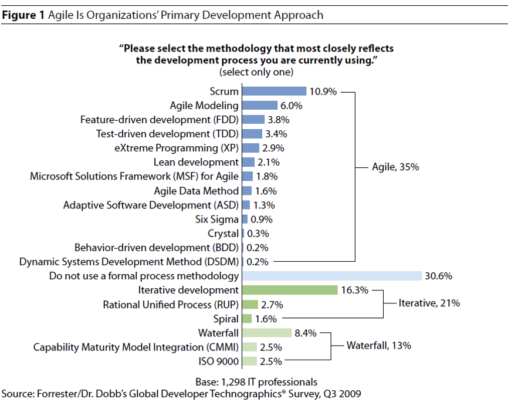
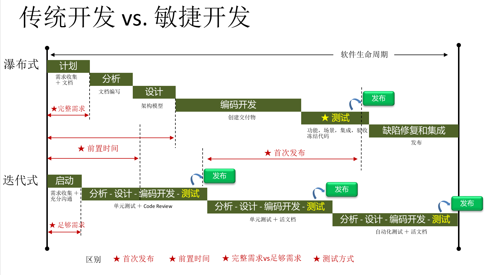

# 关于敏捷开发

敏捷软件开发（英语：Agile software development），又称敏捷开发，是一种从1990年代开始逐渐引起广泛关注的一些新型软件开发方法，是一种应对快速变化的需求的一种软件开发能力。它们的具体名称、理念、过程、术语都不尽相同，相对于「非敏捷」，更强调程序员团队与业务专家之间的紧密协作、面对面的沟通（认为比书面的文档更有效）、频繁交付新的软件版本、紧凑而自我组织型的团队、能够很好地适应需求变化的代码编写和团队组织方法，也更注重软件开发过程中人的作用。

## 敏捷宣言

敏捷一词来源于2001年初美国犹他州雪鸟滑雪圣地的一次敏捷方法发起者和实践者（他们发起组成了敏捷联盟）的聚会。雪鸟会议共同起草了
[敏捷软件开发宣言](http://www.agilemanifesto.org/iso/zhchs/)。其中最重要的部分就是对一些与会者一致同意的软件开发价值观的表述。

## 价值观

> **个体和互动：** 高于 流程和工具。
>
> **工作的软件：** 高于 详尽的文档。
>
> **客户合作：** 高于 合同谈判。
>
> **响应变化：** 高于 遵循计划。

其中左边的描述是右边原则的重点。

## 原则

宣言中还包括以下原则：

- 对我们而言，最重要的是通过尽早和不断交付有价值的软件满足客户需要。
- 我们欢迎需求的变化，即使在开发后期。敏捷过程能够驾驭变化，保持客户的竞争优势。
- 经常交付可以工作的软件，从几星期到几个月，时间尺度越短越好。
- 业务人员和开发者应该在整个项目过程中始终朝夕在一起工作。
- 围绕斗志高昂的人进行软件开发，给开发者提供适宜的环境，满足他们的需要，并相信他们能够完成任务。
- 在开发小组中最有效率也最有效果的信息传达方式是面对面的交谈。
- 可以工作的软件是进度的主要度量标准。
- 敏捷过程提倡可持续开发。出资人、开发人员和用户应该总是维持不变的节奏。
- 对卓越技术与良好设计的不断追求将有助于提高敏捷性。
- 简单------尽可能减少工作量的艺术至关重要。
- 最好的架构、需求和设计都源自自我组织的团队。
- 每隔一定时间，团队都要总结如何更有效率，然后相应地调整自己的行为。

## 敏捷开发方法

除了**敏捷宣言**内所提到的价值观和原则以外，敏捷开发并没有一个完整的方法列表，因为所有的敏捷开发方法都是广大开发人员在日常的工作中摸索出来的，针对某种特定场景适用的方法。也就是说，以下所列出的敏捷开发方法并以一定适用于你的团队或者你的问题，但是敏捷鼓励所有人按照自己的方式尝试任何的方法，只要这种方法遵循以上价值观和原则，那么它就是一种敏捷方法。

- Scrum
- 看板方法 Kanban
- 敏捷建模 Agile Modeling
- 特性驱动开发 Feature-driven development (FDD)
- 测试驱动开发 Test-drive development (TDD)
- 极限编程 eXteme Programming (XP)
- 精益开发 Lean Development
- 微软解决方案框架敏捷版 Microsoft Solution Framework (MSF) for Agile
- 敏捷数据方法 Agile Data Method
- 自适应软件开发 Adaptive Software Development (ASD)
- Six Sigma
- 水晶方法 Crystal
- 行为驱动开发 Behavior-driven development (BDD)
- 动态系统开发方法 Dynamic Systems Development Method (BSDM)
- 探索性测试 Exploratory Testing

以下是Forrester在2009年针对各种敏捷开发方法进行的一项调研结果，其中显示在所有敏捷方法中，Scrum的接受度最高。同时，在接受调研的开发人员中，已经有35%的人员在使用某种敏捷开发方法。

## 为什么敏捷开发可以帮到你?

误解：敏捷开发是为了快速交付？

敏捷开发不是一种为了快速交付而出现的方法，它之所以比较快则是因为避开了许多浪费的处理方式。

敏捷改善了些什么？

- 前置时间：传统开发法依循计划、分析、设计、程序开发、测试再进行修改整合后发布的步骤进行，是一种顺序性的开发模式，当前一个步骤用掉越多时间时则后面步骤的前置时间就会越长，而形成时间上越多的浪费。反观敏捷开发，实行的是一种务实的做法，当收集到足够一次迭代开发的需求时即向下一个步骤前进，尽量缩短前置时间的浪费，然后将"分析、设计、开发与测试"形成一个开发步骤，减少了步骤与步骤之间的衔接时间。
- 首次发布：敏捷开发采用迭代的开发方式，每个循环都会有一个潜在可发布版本用来展示开发成果，这种展示给了客户进行回馈和改进的机会，让客户体会开发成果的作法同时也给予了客户决定开发方向的绝对主权。
- 需求过程：敏捷开发不作完整的需求分析(因为计划总是赶不上变化的)，当需求的搜集量和内容质量已经达到一定要求，已经足够一个开发周期的工作量时就可以开始开发工作。
- 测试方法：敏捷开发对软件带来的最大影响便是测试了。传统的α(内部测试，注2)、β(交付客户测试)、γ测试(优化处理)方式在采用敏捷开发后几乎不存在了，因为敏捷开发在开发周期内不断的在进行测试的工作，因此也就没有了在交付做α、β、γ测试时必须停止开发，冻结开发的时间浪费了。

## 参考

- 关于 [敏捷开发宣言](http://agilemanifesto.org/iso/zhchs/manifesto.html)
- 关于 [维基百科敏捷开发](https://zh.wikipedia.org/wiki/敏捷软件开发)
