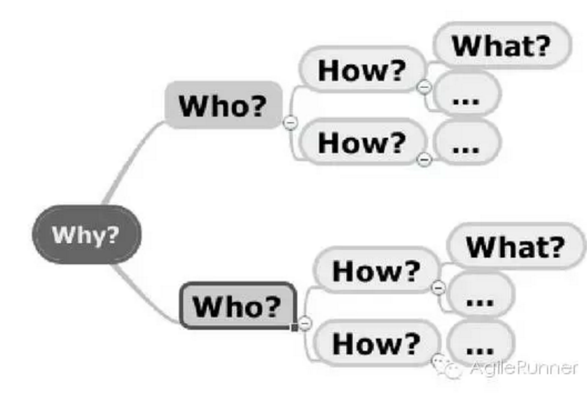
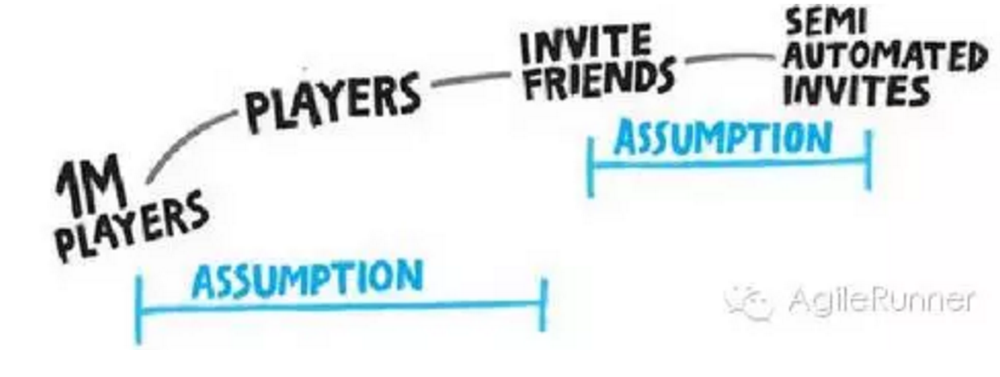
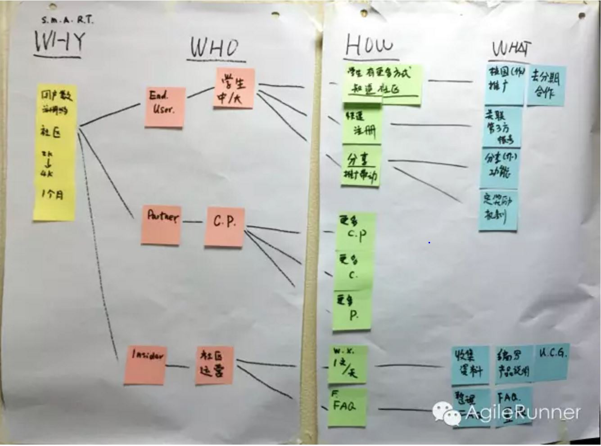

# 影响地图

影响地图是一个简单却极高效的协作性的策略规划方法。有的产品，它还活着，它已经死了；有的产品，还没发布，就已经死了。太多的产品失败的案例，源于方向性错误，基于错误的假设，功能与业务目标/价值之间缺乏必然的关联与一致性，在做的事与期望的目标南辕北辙。影响地图试图通过结构化、可视化、协作化的方式来从源头解决上述问题。

影响地图是一门战略规划技术，通过清晰的沟通假设，帮助团队根据总体业务目标调整其活动，以及做出更好的里程碑决策，影响地图可以帮助组织避免在构建产品和交付项目的过程中迷失方向。确保所有参与交付的人对目标、期望影响和关键假设理解一致。
同时，影响地图可以有效的评估交付，作为质量反馈的标准之一：如果一个需求没有有效的支持期望的行为影响，那么即使在技术上正确，功能交付给用户了，也仍然是失败的。

影响地图试图去解决组织面临的范围蔓延、过度工程、缺乏整体视图、开发团队和业务目标不能保持一致等困扰

## 1.影响地图的结构

简单的讲，影响地图是这样的一个思维逻辑和组织结构：为什么（\**Why）--\>谁（Who）--\>怎样（How）--\>什么（What*\*）
也就是：我们的目标是什么（Why），为了达成目标需要哪些人（Who）去怎样（How）影响，为此我们需要做什么（What）。影响地图通过构建产品和交付项目来产生实质影响，从而达到业务目标。

### 为什么（Why）？

我们为什么做这些？也就是我们要试图达成的目标。找到正确的问题，要比找到好的回答困难得多。把原本描写在文档中，更多的是隐藏在高层利益干系人头脑中的业务目标，定性定量的引导出来。目标描述要遵循SMART原则：Specific明确，Measurable可度量，Action-Oriented面向行动，Realisitc现实的，Timely有时限的。确保每个人知道做事的目的是什么，帮助团队协作，针对真正/合适的需求设计更好的方案。

### 谁（Who）？

谁能产生需要的效果？谁会阻碍它？谁是产品的消费者或用户？谁会被它影响？也就是那些会影响结果的角色。考虑涉及到的这些决策者、用户群和生态系统，注意角色同样有优先级，优先考虑最重要的角色。角色定义应该明确，避免泛化，可以参考用户画像Persona的方式进行定义。

### 怎样（How）？

考虑角色行为如何帮助或妨碍我们达成目标？我们期望见到的影响。只列出对接近目标有帮助的影响，而不是试图列出所有角色想达成的事。影响是角色的活动，是业务活动而不是产品功能。理想情况下应展现角色行为的变化，而不仅仅是行为本身。不同的角色可能有不同的方法，帮助或阻碍业务目标的实现，这些影响彼此之间可能是相互参考，相互补充，相互竞争，或者相互冲突的。既要考虑到正面的影响，也要考虑负面或阻碍的影响。

> 注意：业务发起方应该针对角色Who以及影响How，而不是交付内容What进行优先级排序。

### 什么（What）？

作为组织或交付团队，我们可以做什么来支持影响的实现？包含：交付内容，软件功能以及组织的活动。理论上这里是最不重要的一个层次，避免试图一开始就将它完整列数，而应该在迭代过程中逐步完善。同时注意，不是所有列出来的东西都是需要交付的，它们只是有优先级的交付选择。

"永远不要试图实现整个地图，而是要在地图上找到到达目标的最短路径。"

影响地图足够简单，操作性强，又有足够的收益：能够帮助创建更好的计划和里程碑规划，确保交付和业务目标一致，并更好的适应变化。影响地图的首要任务是展示相互的关联，次要任务是帮助发现替代线路。

正如作者所言：影响地图符合软件产品管理和发布计划的发展趋势------包括面向目标的需求工程、频繁的迭代交付、敏捷和精益软件方法、精益创业产品开发循环，以及设计思维。如果你认同上述趋势，那么影响地图会是你的菜。

## 2.影响地图的特点

- 结构性：从业务目标到交付的结构化梳理和挖掘的方法，目标--角色--影响--交付物；
- 整体性：连接目标和具体交付物之间的树状逻辑图谱；
- 协作性：利益相关人一起沟通讨论协作，把隐藏在个人头脑中的默认的思维逻辑挖掘共享出来；
- 动态性：动态调整、迭代演进、经验证的学习；
- 可视化：统一共享的视图，结构清晰易读；

它将各个部门/角色不同的视角，不同的思维逻辑，不同的前提假设，通过可视化和协作的方式进行梳理、澄清和导出。通过连接交付内容、影响和目标，影响地图显示了之所以去做某个功能的因果链，同时也可视化了各利益相关人做出的假设。这些假设包括：业务交付的目标，涉及目标干系人，试图达到的影响。同时，影响地图沟通了两个层面的因果关系假设：1、交付会带来角色行为的变化，产生影响；2、一旦影响达成，相关的角色会对整体目标产生贡献。

## 3.影响地图分层

是否可以将影响地图分层？ 我认为完全可以而且合理。《影响地图》也提到建议计划两次会议：第一次定义预期的业务目标和度量；第二次来制作一张地图。第一步就是确定使命，而一个战略目标往往太大，无法快速见效，需要拆分成可短期达成的战术目标，根据优先级排序的战术目标，逐次进行影响地图分析，期间动态调整更新，定期决定是否需要继续。

因此可以有两层的影响地图："一份针对整体产品愿景，一份针对中期交付。"

同时，通过分层，也可以有效的控制参与两个会议的人员组成。高阶的领导者未必需要参加所有的影响地图活动，尤其是战术影响地图会议。

## 4.参与人员

Decision Maker，注意一定要有决策者参与，包括：商业决策、技术决策、营销决策（原书中为高级技术和业务人员）。如果发现一个问题讨论很久没有决定，也许是因为缺乏合适的参与人员，应该找更高阶的人员决策。参与人数：原书的建议是将第一次会议人数限制在不超过5-6人，确保关键的业务决策者和技术人员参与进来。随后的会议可以适当扩大规模分组讨论，随后汇总，但人数越多，会议的节奏和范围就越需要控制。

## 5.影响地图与用户故事的关联

### 影响地图可以作为用户故事列表的有效输入

影响地图的输出物，可以作为用户故事的输入，作为Epic、UserStory的来源。这些输入已经经过了价值判断，角色挖掘，优先级排序，甚至已经有了一
部分的验收标准（是否影响了受众同时为达成目标作出贡献），同时也因为有资深技术人员的参与，初步做过技术可行性判断。因此这些backlog的输入，往
往更加靠谱，对交付团队更具价值。

### 输入形式

《影响地图》书中有明确的描述，把三段式的用户故事与影响地图几个层级进行mapping：作为一个Who，我希望What，以便于How。

### 影响地图可以很好的控制用户故事列表无限蔓延

看似动态调整的故事列表，根据精益消除浪费的思想，维护完整的故事列表，事实上也是浪费。存在的问题有两点：第一，看不到用户故事与业务价值直接的联系，往往为了实现功能去做，而不是考虑其背后交付的价值，以及这个价值是否被用户认可；第二，故事列表往往是各方头脑风暴的结果，同时还在不断更新，却很少剔除，这个长长的列表不仅需要定期维护，其背景、内容、优先级、价值等都在随着商业环境的变化而不断变化；事实上维护一个三个月或者半年以后才可能实现的需求就是浪费。

### 目标/里程碑与发布计划

业务目标可以与迭代的发布计划关联，每次迭代只处理少量的目标；《影响地图》建议一次只处理一个目标，目的在于快速反馈和调整；个人认为基于团队规模、迭代步速，一次迭代可以包含几个目标决定于目标的颗粒度以及时间估算，不可一概而论。当然在具体执行时，这里会是一个争论以及变数较多的点。

如何防止思维蔓延，地图扩张
--------------------------

先发散再收敛实战练习中，我们40多人分成6组，分别绘制自己的影响地图；实际场景中，如果每组都基于同一个目标，绘制出来的地图会各具特色而发散，最终需要引导将发散的地图进行收敛，在此过程中，会发现更好的实现或是新的假设导出，最终得到成型的影响地图。

分层和分拆时，掌握80/20原则，不求面面俱到，只需要涉及最关键重要的因素。考虑到大部分团队会使用物理板+即时贴的方式进行影响地图的设计，个人以为，原本因为物理空间受限以及可读性原因存在的物理白板的弊端，反而可以作为细化程度的一个有效限制原则（正如著名的两个披萨原则）：以物理墙/白板为影响地图的最大边界。

相对于我们通常关心的业务功能/营销活动，即影响地图的第四层What，我们更应该把把注意力放在前三层目标、角色和影响上，尤其是角色和影响上，关注点如此，优先级排序也是如此；先不要关注在What即自己要做什么事情上，这往往会让我们陷入执行的细节，埋头做事，而忽略了事情的初衷。

多数的路径最终不会被执行，是否需要保存？ 首先要避免过早陷入过多的细节，未来一切都是未知的，所有的都是基于当前的假设，所以维护一份完整的地图，试图将所有想法都归纳在地图上，是没必要的。其次，目标导向，避免在那些对整体目标没有作用的影响上花费过多的时间。整理出来的路径，当然可以保留下来，作为下一次影响地图的部分输入。

此外，需要注意的是，What包含交付内容、软件功能和组织的活动，如果交付的所有条目都是技术性，也许要重新审视影响地图，尤其是角色Who与影响How两部分，并非所有的目标都是需要通过产品功能达成，更多情况下，也许一个简单的营销活动就可以快速实现目标。

## 什么时间结束

### 影响地图会议何时结束

"当关键想法已经出现在地图上"，当已经达成目标，并且确定最快/小路径，暂时也想不出更好的替代方案时，就可以结束。建议设定严格的timebox，一旦出现时间点超时，或者是团队陷入太过细节的讨论，或是没有找对合适的人，缺乏合适的决策者，也许是业务决策者，也许是技术决策者。

### 影响地图何时失效

如同计划，在制定出来的那一刻也许影响地图就已经失效，因此需要适时调整（注意是适时，未必是实时）。影响地图更像是迭代计划，每个影响达成，进行反馈评估，对影响地图的内容以及优先级进行调整；一旦目标达成，也许这张影响地图就完成了使命。

### 影响地图可以在哪些方面应用

影响地图的思维方法和逻辑结构是普遍适用的，因此可以应用到很多领域，诸如旅行，健身，减肥，教育，学习计划，战略目标，营销战略，销售计划等；但实际执行的过程未必要完整的按四个阶段进行。

### 对影响地图实践的个人体会，归纳为"三心二义"

**不忘初心** 始终牢记做事的初衷是达成业务目标，而不是实现功能，甚至不是达成影响（如果影响最终不能帮助实现目标）；

**不要贪心** 不要试图一次完成好几件事，而应该分拆成多个里程碑，多张地图；不要试图一件事做完美，期望把所有列出来的事情都完成是不现实且没必要的；掌握80/20原则，达成目标即可，业务环境始终在变，业务关注点也会随之变化；

**赤子之心** 不偏不倚，不骄不躁，边走边学边调整，对目标和未来抱着一颗坦诚、恭敬与探索的心，不否定、不自大、不盲从。

**批判主义** 怀疑一切，多问几个为什么；把假设引导出来，通过分析和实践来验证假设；

**实用主义** 一切以实用出发，价值导向，目标导向，结果导向，保持简洁；

参考 《影响地图》中文电子书：http://www.ituring.com.cn/book/1395

Agile1001搜索微信公众号：Agile1001
