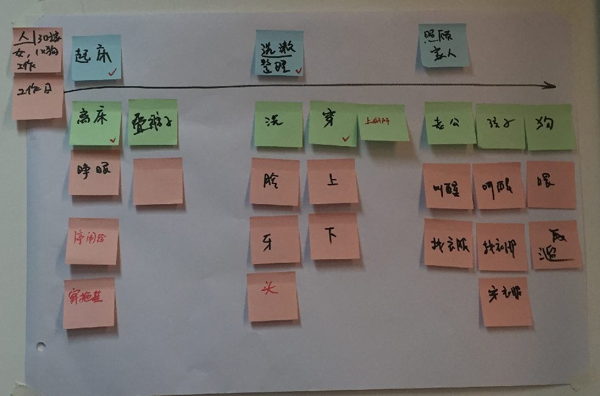
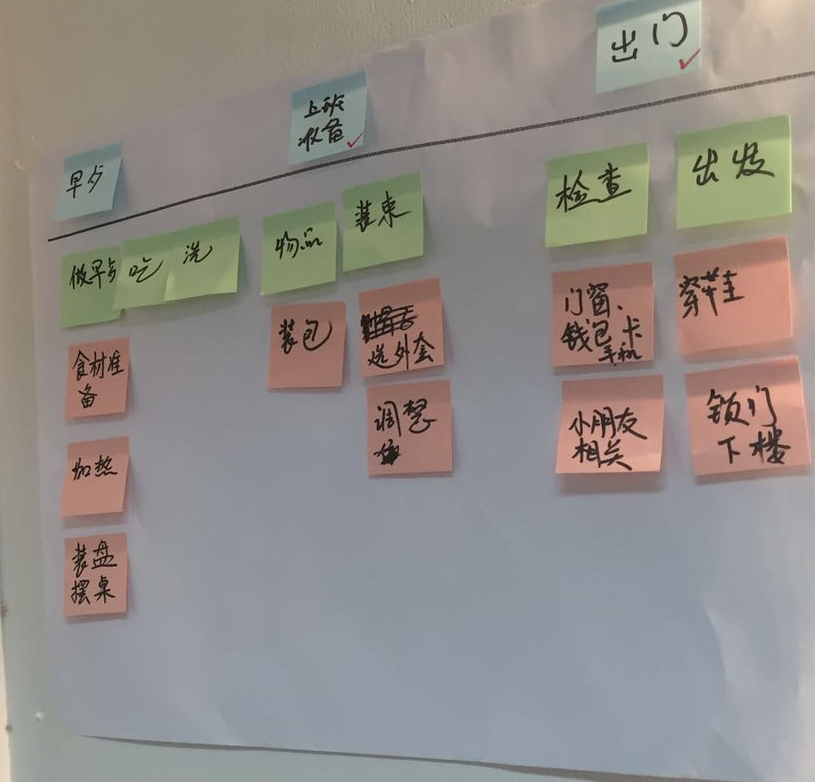
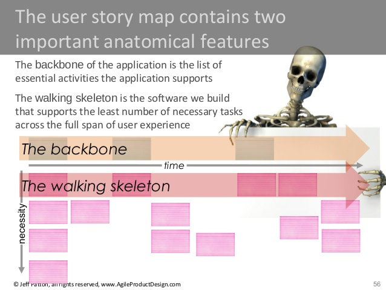
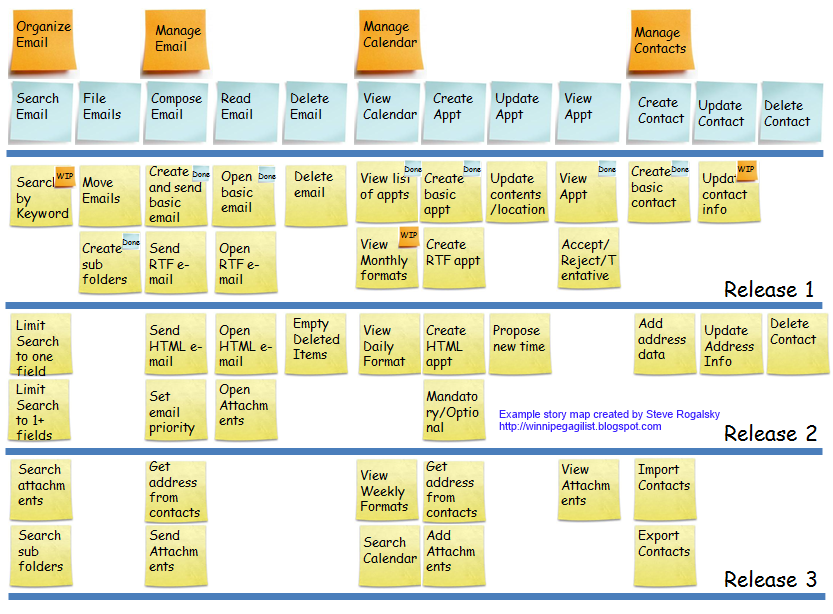
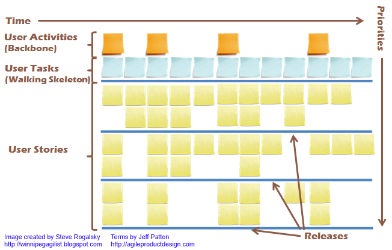

# 故事地图

[《用户故事地图》](http://item.jd.com/1342308875.html)这本书的原作者 Jeff Patton 是一位独立顾问，讲师和敏捷教练；他所提出的用户故事地图的方法主要用于解决敏捷需求分析过程中的问题：

- **只见树木不见林**，重要的待办项容易淹没在各种细节中看不到全貌，因而难以排列优先级
- 不能明显地聚焦于用户需求
- 很难了解不同粒度故事(史诗故事、主题故事以及故事)之间的关系 --
- 不能方便地了解系统提供的功能的完整性 --
- 不能方便地了解系统提供的工作流以及价值流 --
- 不能方便地利用递增和迭代的方式去确定发布计划以及发布目标

当开始进行一个产品或者项目规划的时候，首先需要梳理出一个backlog，在其中按照优先级列出所要实现的场景和具体功能。这时我们首先遇到的一个问题就是如何确保我们的backlog覆盖了最重要的用户体验路径，是否我们当前所规划的场景确实可以为用户提供价值？这点对于敏捷开发非常重要。对精益有一定了解的朋友一定知道MVP（Most Variable Product最小化可用产品）的概念，MVP的目的是以最小的投入发布对用户有价值的产品，帮助我们快速试错，并通过不停的迭代最终找到产品的正确方向。这个思路很好，但如何确认我们的backlog中的内容是那个"最小的"而且"可用"的产品却是件很困难的事情。我在和团队一起讨论初始产品需求的时候常常会因为大家的理解不同而花费大量的时间进行梳理，但却发现每次即便我们将结果用文档记录下来，大家仍然缺乏对产品的总体认识，这就是所说得"只见树木不见林"的状态 ... ... 因为，缺乏一种将用户故事可视化的方法。

## 1.用户故事可视化 -- 起床故事

今天的实战工坊中最精彩的部分就是团队演练，李老师首先对用户故事地图的结构进行了简单介绍，然后要求我们分组讨论一个最简单的场景：早上起床出门。以下就是我和小伙伴们整理的第一个用户故事地图：

- 每个人都非常熟悉这个场景，但是当我们开始讨论的时候，2个问题开始浮现 
- 每个人习惯不同，如何统一我们的故事？
- 从起床到出门要经历几个不同的阶段，到底应该如何确定阶段？

第一个问题其实是"用户故事"要解决的首要问题，这个场景的角色（Persona）是谁？第二个问题其实就是确认需求的粒度过程。

在敏捷需求分析过程中，对Persona的确认非常关键，如何统一大家的思路并让大家可以在讨论某个场景的时候可以聚焦到特定的Persona上是我之前经常遇到的问题。讨论中经常会跑偏，本来谈这个Persona，结果跑到另外一个Persona上去了。今天讨论中，我们首先将Persona的定义通过卡片贴在了时间线的左侧，这个很小的动作，却让团队的成员可以非常专注于当前Persona的场景讨论，效率很高。

再说说粒度，以前经常有人问我backog item的粒度如何确定，而我的回答经常是从实现的角度来考虑，比如：控制在2-3天的工作量上。其实这是个非常不靠谱的建议，因为在讨论需求的过程中还无法确认是否要做，更谈不上评估工作量。

这里暴露了Scrum的一个最主要的问题，backlog解决的是在story确认以后如何进行开发过程规划的问题，而对story该如何产生，如何设计的问题并没有给出很好的解决办法。我们往往把story当成需求来看，而实际上敏捷使用story来描述需求的目的是为了协助团队进行讨论，以便最终确认需求（也就是specification）。用户故事地图的作用就是将user story的简单描述：

> As a .... I want to ... so that ...

用可视化的方式展现在团队面前，让团队可以仔细梳理，讨论，确认这个story包含的内容，最终产出specification进行开发。

## 2.用户故事地图的结构

- 每个用户故事地图代表一个完整的用户故事
- 地图的核心是一条从左到右的时间线
- 时间线的上部放置最大粒度的内容（可以理解为Epic
- 时间线的下部的第一行放置二级粒度内容（可以理解为backlog item），并在每个一级粒度下按照从左到右的优先级进行放置
- 每个二级粒度内容的下面，自上而下放置三级粒度内容（可以理解为task）

最终我们绘制出来一个完整的端到端的用户故事。今天的"起床故事"体验中感受最强烈的是：大家专注，目标明确，讨论完成的故事非常完整。

## 3.创建用户故事地图(User Story Mapping)的8个步骤

1. 召集到3-5名对产品非常熟悉的人员参与。3-5人听上去像是个魔法数字，实际上是的。因为更少的人意味着你无法获得足够的建议，而更多人则会因为讨论和协调降低会议效率。

2. 使用静默头脑风暴模式，让每个人在便签纸上写下自己认为重要的"所要做的事情"也就是 用户任务（user task）。每个人都用同样颜色的便签来书写自己的用户任务描述，这个阶段不要互相讨论。一旦大家都基本完成了准备，让每个人轮流大声读出自己的内容，并把便签纸全部放置在桌面上，这时如果出现重复的内容就可以省略掉：

A.  根据你的产品规模，这个过程可能需要3-10分钟的时间；你可以观察大家的行为来判断是否需要停止。
B.  基本上每张便签都会以一个动词开头，如：发送邮件，创建联系人，添加用户等。
C.  这些便签组成了一级用户故事，Jeff Patton称为用户任务（user
    tasks），它们组成了用户故事地图上的 "行走的骨骼" （the
    walking skeleton）部分。
D.  这时可以提示参与者：我们只用了很少的时间就完成了需求的收集过程，而且有些内容你可能没有想到，而其他人帮你想到了。

3. 然后，让大家将桌面上所有的便签进行分组，将类似的任务分为一组，其他的的类似:

A.  这个过程最好也让大家采用静默模式进行，因为这样做会更快。如果发现重复的内容，就略过
B.  基本上分组会很容易完成
C.  这时同样观察每个人的行为，判断大家是否已经做完，基本上这个过程需要2-5分钟

4. 选择另外一个颜色的便签，对每个组进行命名，并贴在每组便签的上部

5. 对这些分好组的便签进行排序，一般按照用户完成操作的顺序，从左到右摆放:

A.  如果大家无法决定顺序，那么顺序可能没有那么重要（明显）。
B.  这一组便签，Jeff Patton称为 用户活动 （User Activities）
C.  这时你的地图应该类似于

| A1        |    A2     |    A3     |    用户活动 |
| ----------| --------- | ---------- | ---------- |
| T1,T2,T3  | T4,T5,T6  | T7,T8,T9  |  用户任务 |

6. 现在，按照 "行走的骨骼" 用户行为这行开始讲述用户故事，确保你没有遗漏任何用户行为和用户任务。这时一般由组织者进行讲述，其他人提出意见，甚至可以让最终用户来参与讨论。

7. 这时，我们已经完成了用户故事地图的基本框架；可以在每个用户任务下面添加更加细节的 用户故事（User Stories）了。这时仍然建议使用静默头脑风暴的模式来进行第一轮用户故事的产生，同时借助如Persona和Scenario等方式协助完成这个过程。一旦你完成了用户故事的创建，就可以开始划定你的 发布计划（Releases）了

A.  一般我习惯在第一个发布中只选择每个用户任务的2-3个用户故事。这对于帮助大家排定优先级和范围将很有帮助。
B.  基本上我们不必使用用户故事的标准句法（As a
    ...）来书写这些故事，因为每张便签都处于我们的地图的特定位置，大家很容易识别其所处的场景和角色。

8. 最后，针对第一个发布的所有用户故事进行分解，确保我们的第一个发布越小越好，基本上你需要保证在1-2个迭代后就可以发布你产品的第一个版本。

## 4.用户故事地图样例

这里是一个电子邮件系统的用户故事地图

第二行所包含的内容就是"大家在电子邮件系统所要做的事情"，包括类似：书写邮件，发送邮件，创建约会等等。
第一行对这些事情进行了分组
黄色的便签的第一行包含了最小化的用户故事，如：写邮件只包括发件人，收件人，标题，内容和发送取消按钮。其他如支持RTF，HTML格式，添加附件，从通讯部获取联系人邮件地址等，都不在此行，放入更靠下的便签中。
黄色便签上的更小的蓝色和橘黄色便签表示了不同的状态，比如：蓝色代表完成，橘黄色代表进行中（wip），这样你就可以看到项目的进展

现在如果我们专注于从左到右完成第一行的黄色便签，我们就可以确保很快发布一款包含了最最基本功能的邮件系统。这样我们就可以验证我们的邮件系统整体架构（发送邮件同时确保其可以被阅读）可行。同时也可以帮助我们对系统的功能进行端到端的测试，确保我们可以从用户处获取到反馈，知道我们是否解决了它们的问题（提供了商业价值）。注意我们在第一行没有包含"删除邮件"这一功能，因为并不一定要完成所有用户任务的开发。

## 5.用户故事地图规范

第2个步骤中的便签表示 用户任务（user tasks），蓝色便签
第3-4个步骤中的便签表示 用户行为（user activies），橘色便签。Jeff
称这两行的内容为 "行走的骨骼"（walking skeleton）和 "主干"（backbone）
用户故事（user stories），黄色便签在每个用户任务下自上而下排列，便于我们确定优先级
一般来说用户会按照从左到右的顺序来使用你的系统（用户故事地图）

