# 样例项目背景

我们的动手实验将引用一个真实应用。这个样例叫做PartsUnlimited，是根据《凤凰项目》这本书为背景制作的。

本书讲述了一位IT经理临危受命，在未来董事的帮助和自己"三步工作法"理念的支撑下，最终挽救了一家具有悠久历史的汽车配件制造商的故事。小说揭示了管理现代IT组织与管理传统工厂的共通之处，让读者不仅能对如何管理IT组织心领神会，更重要的是将以完全不同于以往的视角看待自己的工作环境。

为了让开发者验证微软的DevOps工具链，微软提供了一套以本书中的PartsUnlimited公司为背景的样例程序，由三部分构成：

- 使用ASP.NET VNext电子商务网站
- 使用开源的Java和MongoDB的生产管理系统
- 以及中间件系统

全部源代码可以通过GitHub下载，地址：https://github.com/Microsoft/PartsUnlimited

这次所做的演练是基于ASP.NET的电子商务网站中的用户故事而做的。共完成了5个故事，涵盖了用户注册，登陆，查看产品，下订单等主要流程。下面的图片所展示的是PartsUnlimited开发团队使用"用户故事地图"的方式针对这5个用户故事进行的功能点分解，用户故事本身在第一张图片中按照用户的操作流程进行展示，每个用户故事在不同的功能区域（模块）中所需要的功能点在第二张图片中展示。

我们提供了部署好的样例项目站点：http://partsunlimited.chinacloudsites.cn/

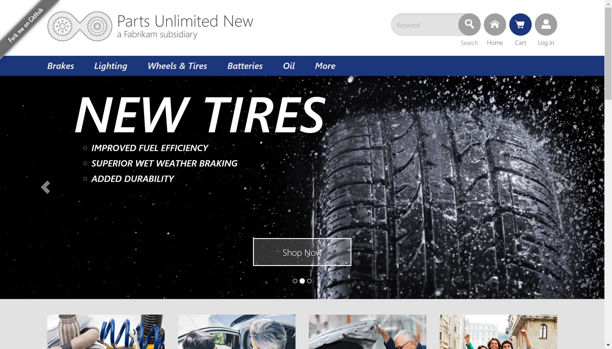

以下为预先完成的样例故事地图

## 1.新用户注册

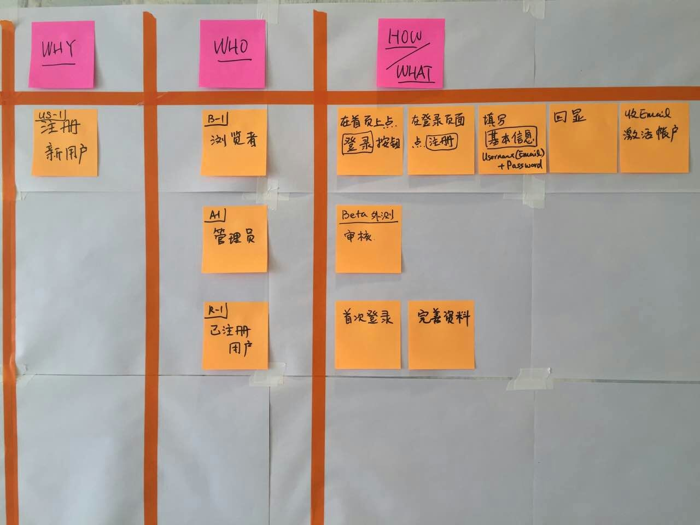

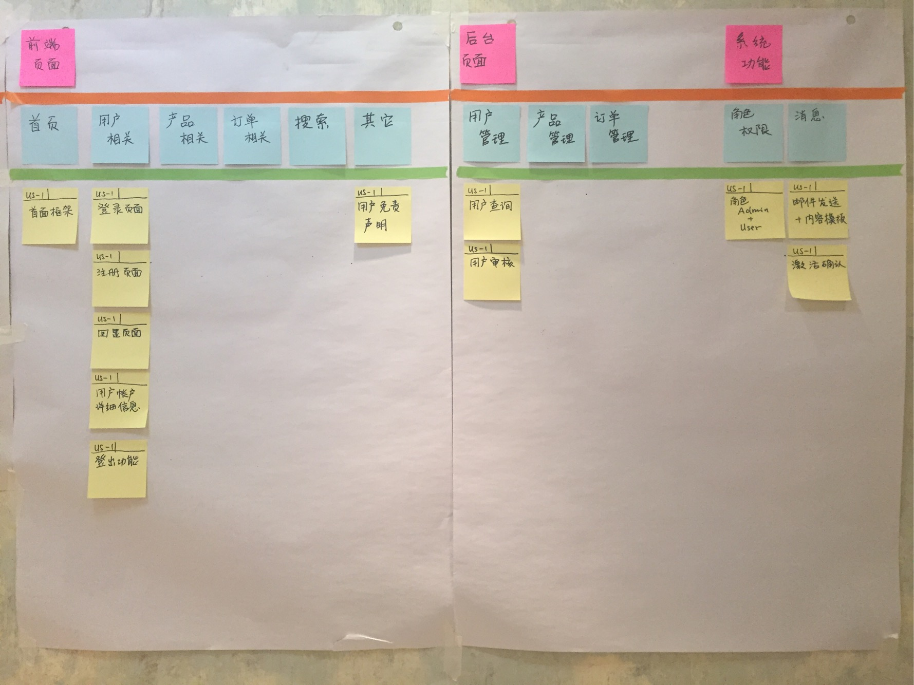

## 2.浏览产品

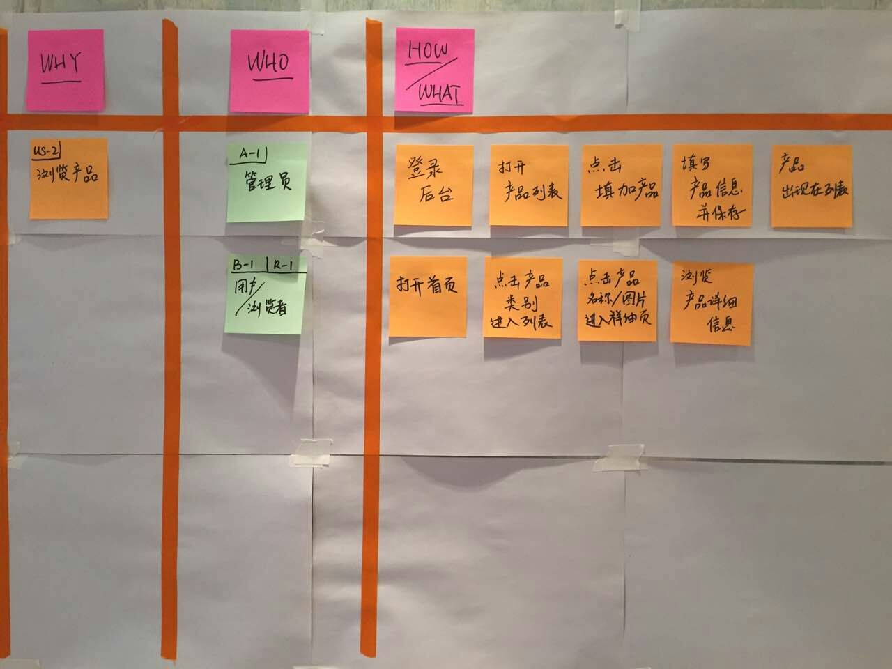

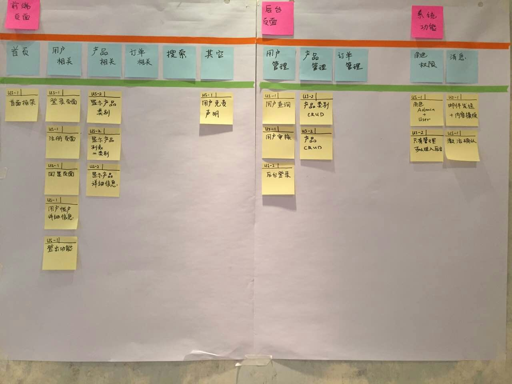

## 3.下订单

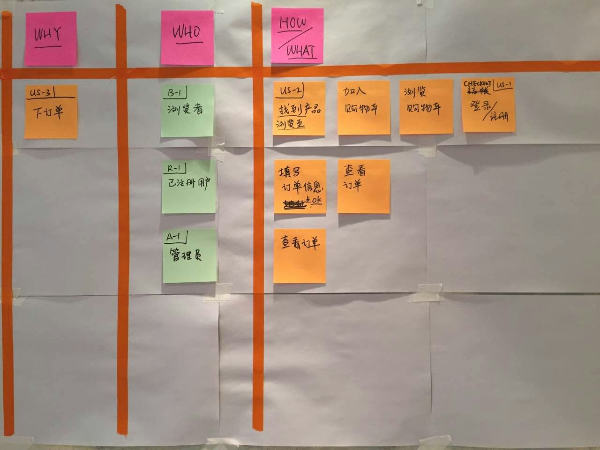

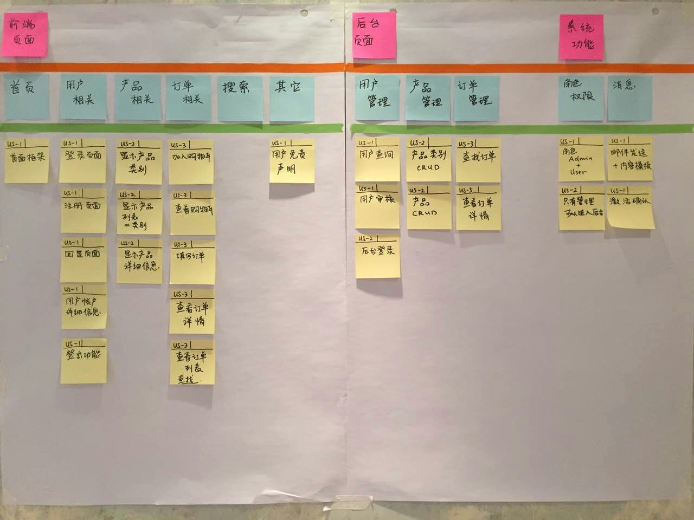

## 4.主页促销

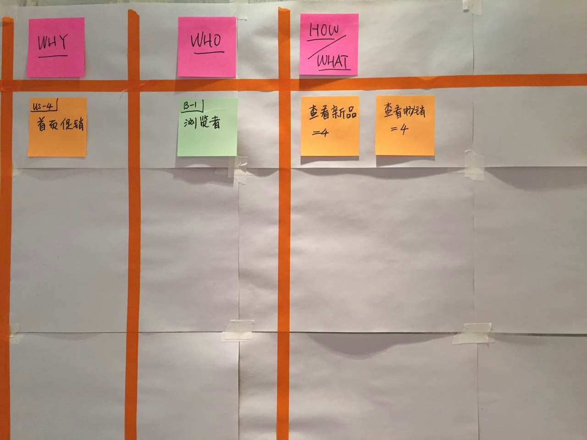

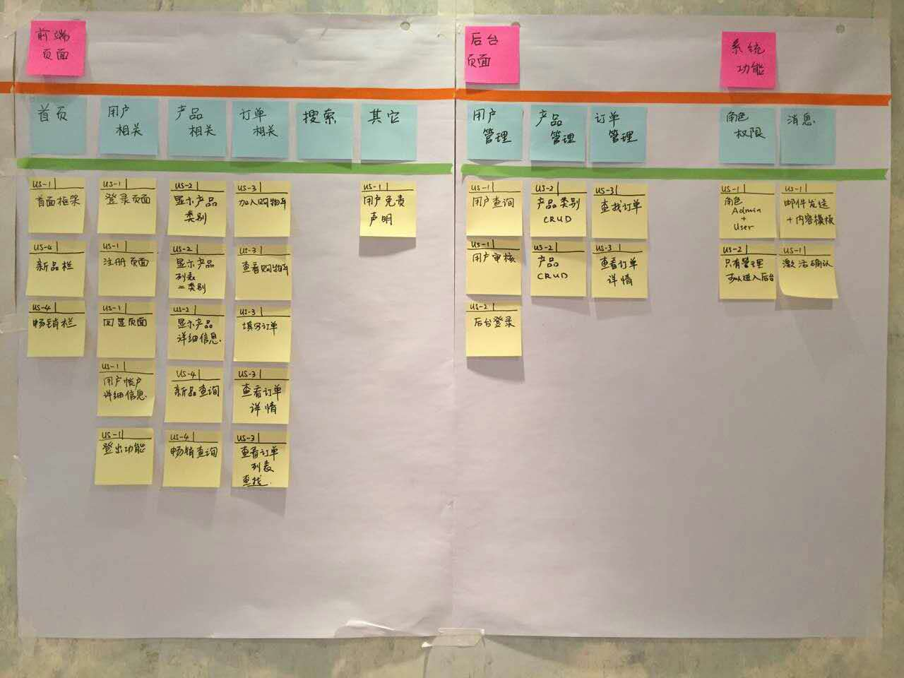

## 5.产品搜索

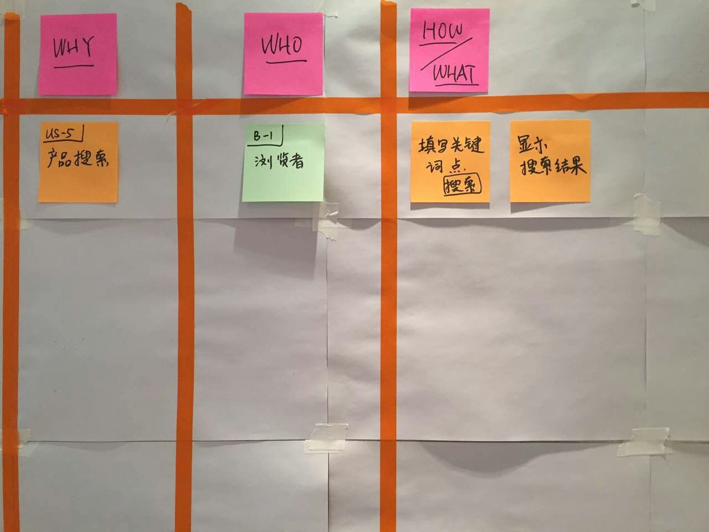

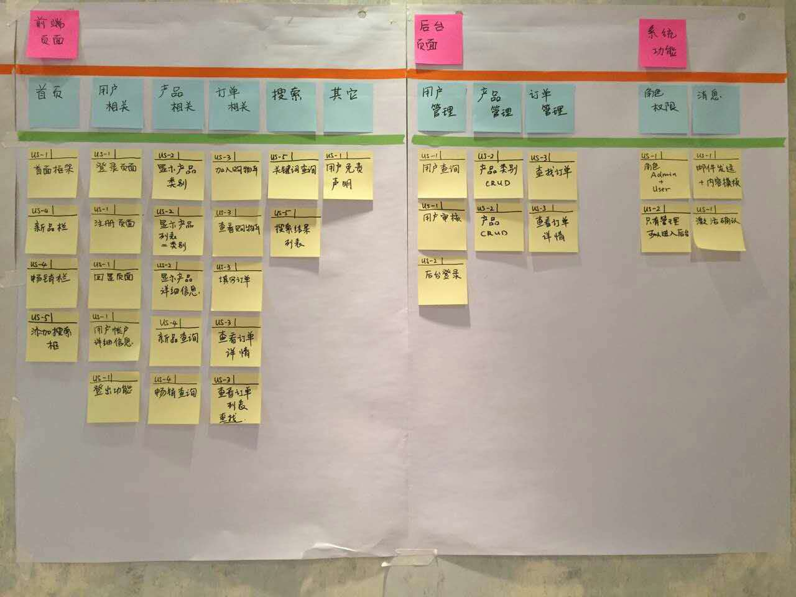

## 6.最后我们将用户故事放入Kanban中的待开发一栏

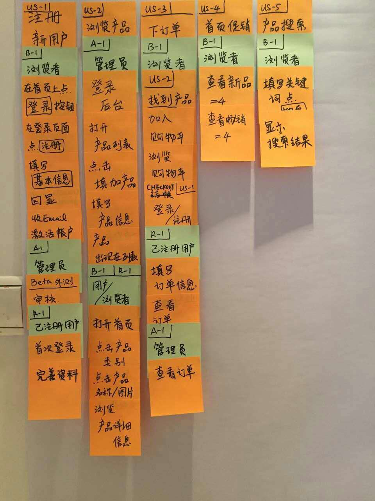

这些用户故事构成了PartsUnlimited应用的backlog，其中用户故事和功能点分别使用两种不同类型的工作项出现在TFS的敏捷规划工具中。

## 开发团队组织

下面介绍下我们这个样例项目的Scrum团队。Scrum中的角色主要分为产品负责人（Product Owner）,Scrum主管（Scrum Master）和开发团队。

- 产品负责人（Product Owner） 职责：主要负责编写用户故事（User Story）,为用户故事排列优先级并放入产品积压工作（Product Backlog）
- Scrum主管（Scrum Master）职责：确保所有项目参与者都遵守Scrum规则，保证团队开发计划的正确执行，消除那些影响团队交付目标的障碍，也是团队与外界交互的接口，屏蔽外界对开发团队的干扰。
- 开发团队 职责：通过实行自管理、自组织和跨职能的开发协作，实现每个迭代的开发计划和产品交付

