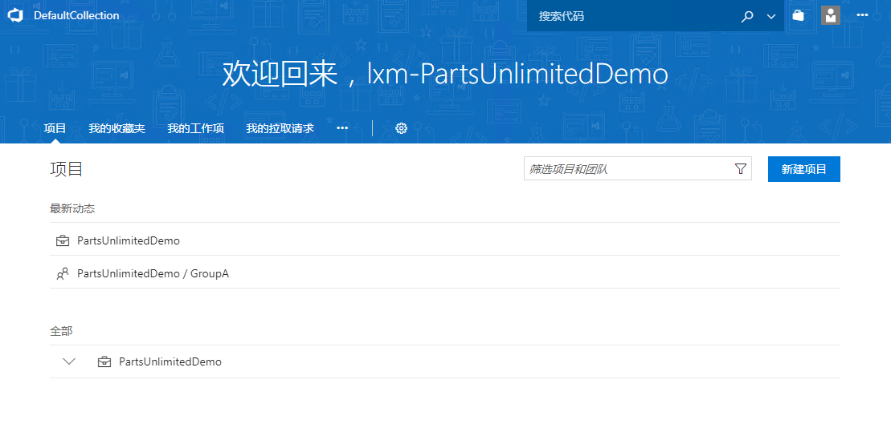

01：创建TFS积压工作列表
=============================

本练习使用Team Foundation Server 2017，团队项目使用标准Scrum模板。
学员将学会如何将影响地图与故事地图导入到TFS 2017中。

我们将使用样例项目PartsUnlimited的影响地图与故事地图生成相应的积压工作列表。

任务一：通过影响地图分析用户故事地图
------------------------------------

既然我们已经通过影响地图分析出了我们想要做什么，接下来要使用用户故事地图做更加细化的需求分析，需求分析时就将用户影响地图中的
**What** 拆分成可以直接交付给开发团队的用户故事。请看下图的对应关系：

将影响地图中的What详细分解成用户故事，并分别放置在所属的故事地图中的用户活动下。其中用户活动对应的是TFS中的区域。

任务二：登陆TFS Web门户
-----------------------

1.  打开浏览器打开TFS门户。

2.  使用分配的TFS帐号登陆。

3.  从TFS主页中，选择 \*\* PartsUnlimitedDemo/GroupA \*\*
    打开项目和团队信息。

5.  接下来会出现团队的默认主页视图。该视图提供包含各种信息的卡片组合，例如查询结果卡片、新建工作项卡片、冲刺燃尽图卡片、团队成员卡片等等。

任务二：将影响地图导入到影响积压工作列表
----------------------------------------

通过TFS的 [Portfolio
Management](https://www.visualstudio.com/zh-cn/docs/work/scale/portfolio-management)
功能，将影响地图的 **What** 导入到TFS的 **特性** 工作项中。
在登录的团队项目页面中，打开工作页面。

在 **特性** 积压工作列表页面创建 **特性** 工作项。

在 **特性** 工作项中，将 **What** 的内容输入到 **特性**
工作项的标题字段中，点击 **保存和关闭** 工作项中。

将所有特性使用这种方法导入到TFS中。

任务三：故事地图中用户活动与TFS区域的映射
-----------------------------------------

试验环境中已经预先按照样例项目的故事地图的用户活动配置了TFS区域，如下图：

学员可以根据自己的故事地图配置 **团队项目** 的区域。 1. 登陆后，打开
**团队项目管理** 中的 **工作** 页面。

1.  接下来我们需要为我们的项目创建区域路径。区域路径是从我们
    **样例项目背景** 的 **用户故事地图** 地图中提取出来的。点击 **区域**
    选项卡，我们可以看到当前只有以项目名称命名的根区域。我们先选择根区域，然后点击
    **新建子级** 按钮，弹出 **新建区域** 窗口，在 **区域名称**
    中输入"前端页面"，点击 **保存并关闭** 。

1.  可以看到在根区域中下一级出现了"前端页面"区域。同理可以在根区域中加入"后台页面"、"系统功能"。同理，当我们选定"前端页面"这个区域时，点击
    **新建子级**
    按钮，我们就可以在该区域下新建子区域了。我们可以将用户故事地图中的区域信息按照这样的方式完整的录入到
    **区域** 下。

任务四：将故事地图导入到TFS积压工作列表
---------------------------------------

将故事地图中的用户故事导入到TFS的 **产品积压工作项** 中。 打开
**积压工作项** 页面，按照下图的方式将用户故事的内容输入到
**产品积压工作项** 的标题字段中，根据故事故事所属的 **用户活动** 选择
**产品积压工作项** 的 **区域路径** 字段，如下图：

请注意你所创建的工作项会被添加到当前 **积压工作页面**
选择的工作项位置，你可以通过点选不同的工作项来控制将新工作项直接放入特定位置。

如果你的工作项不在正确的位置，请使用鼠标拖拽完成优先级排序操作。

任务五：TFS积压工作列表的结构
-----------------------------

现在 **特性** 积压工作列表页面中已经导入了影响地图中的 **What**
了，如下图：

现在我们建立 **产品积压工作项** 与 **特性**
之间的关联关系。在积压工作列表页面打开 **映射** 与 **父级**
功能，根据影像地图的 **What** 与故事地图中 **用户故事**
的关系，将产品积压工作项拖拽到右侧的 **特性** 工作项，如下图：

最后可以通过在 **积压工作列表** 中添加列 **区域路径** ，将
**产品积压工作项** 的 **区域路径** 显示在积压工作列表页面。

