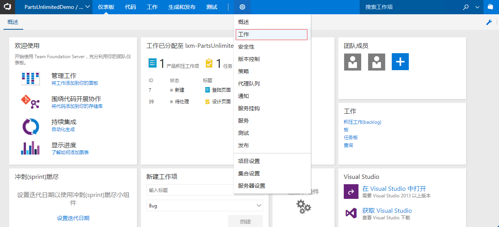
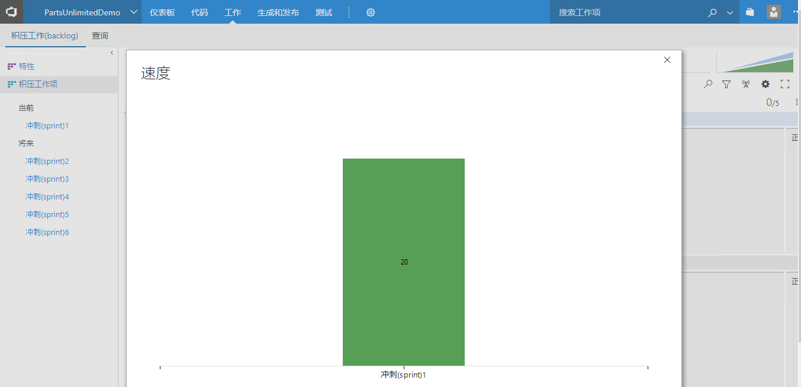

02：在TFS中创建迭代计划
=============================

本练习使用Team Foundation Server 2017，团队项目使用标准Scrum模板。

在练习中，学员将学会使用TFS
2017创建迭代计划，使用看板以及配置团队仪表盘你

任务一：运行迭代计划会议
------------------------

从上一个实验中我们已经创建好了积压工作列表，现在我们要根据已经创建好的积压工作列表创建迭代计划。

1.  在浏览器中登录TFS，（可参考:[创建TFS积压工作列表](./../01-create-backlog-by-impact-story-mapping/index.md)
    中的任务二）
2.  点击屏幕顶部的 **工作** 标签来导航到积压工作项界面。

3.  在产品积压工作列表中，工作项是按照优先级来进行排序的，优先级高的位于最上面。PO可以根据业务优先级通过拖拽进行优先级排序。

4.  现在我们需要细化 **产品积压工作项**
    ，并预估工作量。按顺序双击打开已经创建的工作项，我们可以在工作项信息界面中配置该工作项的详细信息。

将该工作项指派给其他成员 ，设置状态为 **已批准** ，将工作量设置为 **8**
。点击 **保存并关闭** 按钮

在Scrum中，敏捷团队一般使用 **故事点**
的方式来标识工作量，故事点使用1，2，3，5，8，11这样的 **斐波那契数列值**
来标识相对工作量。由于在我们进行项目规划时往往无法准确的估计工作量的大小，但是不同工作项之间的相对大小比较容易判断，所以我们这里只标识相对工作量的大小，而将更加准确的工作量估算留待迭代中进行，因为那个时候团队将对积压工作进行分解，形成具体的开发任务，这是我们就可以使用小时来进行更加准确的估算了。

关于 **斐波那契数列值** ，请查考

<https://zh.wikipedia.org/wiki/%E6%96%90%E6%B3%A2%E9%82%A3%E5%A5%91%E6%95%B0%E5%88%97>

关于 **故事点** ， 请参考

<https://agilefaq.wordpress.com/2007/11/13/what-is-a-story-point/>

5.  通过将刚更新的工作项拖拽到当前的迭代上来指定该工作项处于当前的迭代周期内。

注意屏幕左侧所列出的迭代列表，这些可以被视为迭代开发计划，将工作项拖入这些节点表示将工作项加入开发计划。

可以在列表中检查该工作项的 **迭代路径**
列的值来确定该工作项是否已分配到当前迭代周期内。

如果工作项的状态设置为 **已关闭**
时，该工作项将会从该列表中消失。这样设计正是表达了"积压工作"的含义，只有那些还没有完成的工作才会被显示在这个列表中。

6.  产品积压工作项视图中我们可以点击右上角的两个缩略的小图表来打开速度图和累积流。速度图通过对比团队在每个迭代完成的工作量来反应团队的开发速度情况。累积流表示在一段时间里处于不同状态的工作项的数量及其变化趋势。

任务二：团队容量计划
--------------------

1\. 点击左侧的 **冲刺（sprint）1**
，进入迭代1的工作项视图。在此视图中可以看到我们刚放入迭代1的积压工作项。利用上述方法我们添加多个积压工作项，并将其放入迭代1中，如下图所示。同时在此视图的右上角我们可以为该迭代设置起始日期。一旦我们为迭代设置起始日期后，我们就可以为这个迭代内分配团队资源了。
迭代内的团队的资源分配可以通过 **容量** 视图来设置。

2.  选择 **容量** 链接来查看和设置迭代1的团队资源。在 **容量**
    视图中，我们可以看到每个团队成员都对应有 **休息日** ，\**活动*\* ，
    **每天的容量** 三个字段。其中 **休息日**
    表示该成员在这个迭代中有多少天是不工作的，\**活动*\*
    表示该成员在迭代中所做的工作是什么类型的，每天的容量表示该成员在一天中花多长时间来处理迭代中的工作。

4.  回到我们的 **积压工作（backlog）**
    视图，我们假设我们新建的积压工作已经确认通过了，那么现在可以将该积压工作添加任务。选定该积压工作，然后点击左边的
    **+**
    符号来添加任务。这个任务将会自动表现为积压工作项的子任务，用来帮助描述为了实现该积压工作所需要的技术实现细节。

5.  我们可以为新加的子任务设置 **标题** 为"页面设计"，\**指派给*\*
    设置为团队成员 ，\**剩余工作*\* 设置为 **6** ，然后 **保存和关闭**
    。

这里的 **剩余工作** 字段所设置的 **6** 一般表示6个小时。

6.  此时我们可以打开右上角的 **工作详细信息** 标签的 **打开/关闭**
    按钮来查看当前迭代容量情况。其中 **工作** 中的 **团队**
    进度条表示当前迭代团队的可用工时与剩余工时，\**工作方式活动*\*
    下的进度条是按照 **容量** 设计中所包含的活动进行分组统计的，比如
    **开发** 进度条表示当前迭代中所有容量活动设置为 **开发**
    的团队成员剩余的可用工时与实际剩余工时的统计。\**工作方式：指派给*\*
    中显示的是所有设置 **容量**
    的团队成员的在当前迭代中剩余的可用工时与指派给团队成员的实际剩余工时。

工时的计算都是通过当前迭代指派给团队成员的 **任务** 工作项的
**剩余工作** 字段所设置的工时进行计算的。

