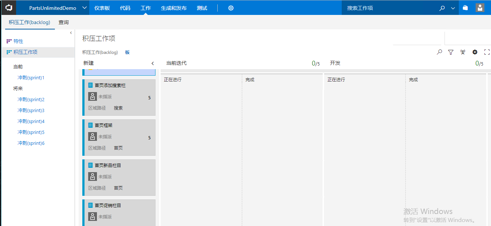
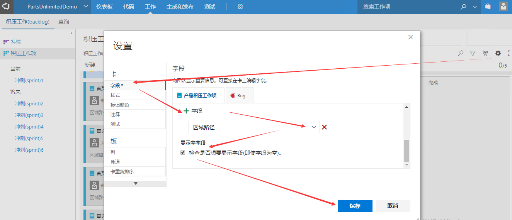
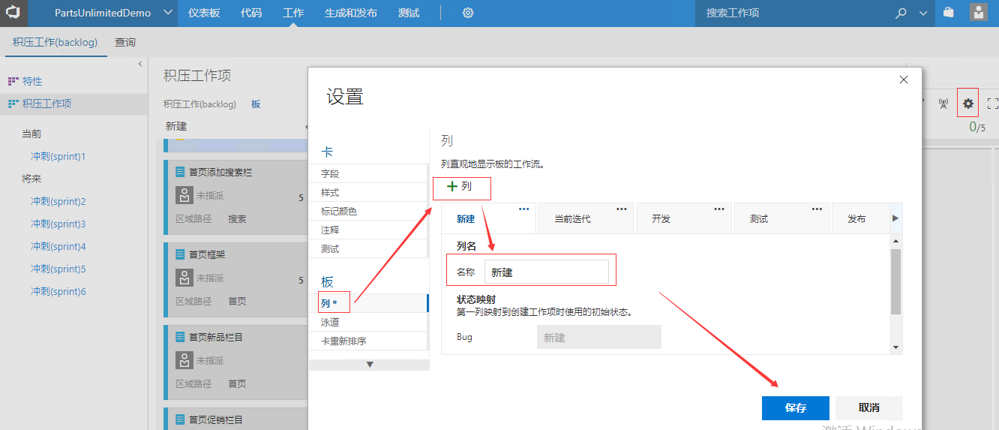
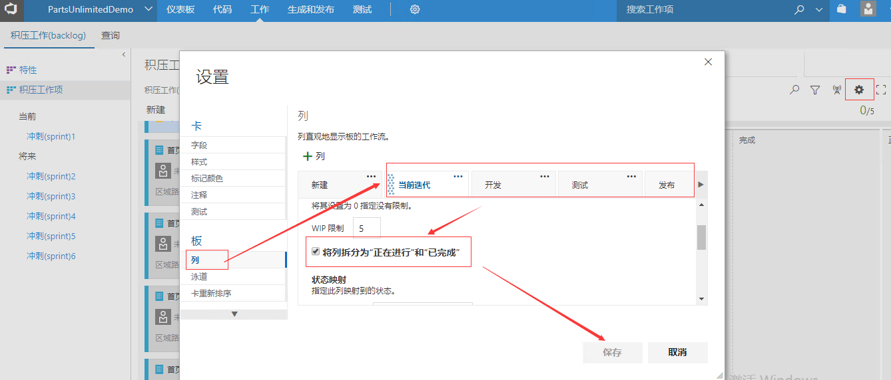
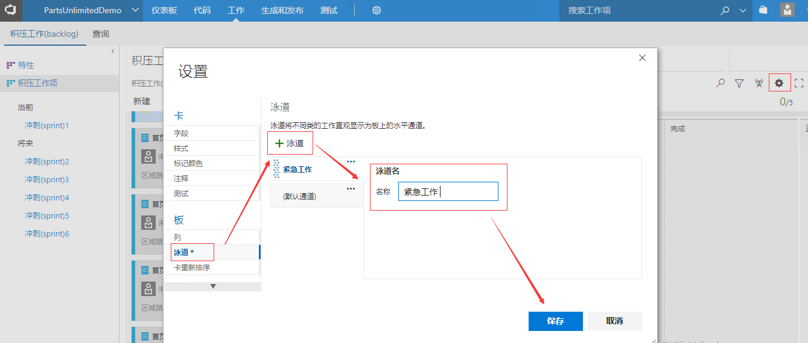
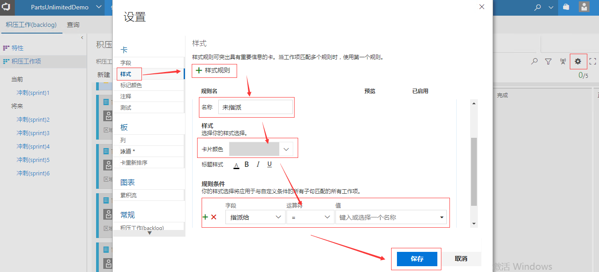
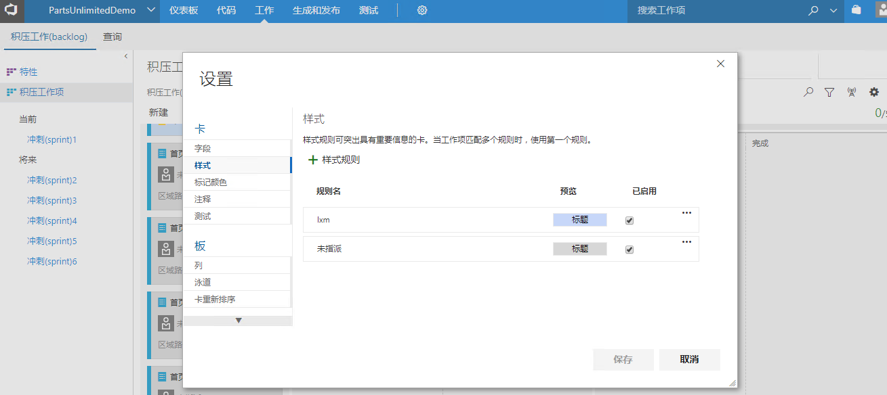
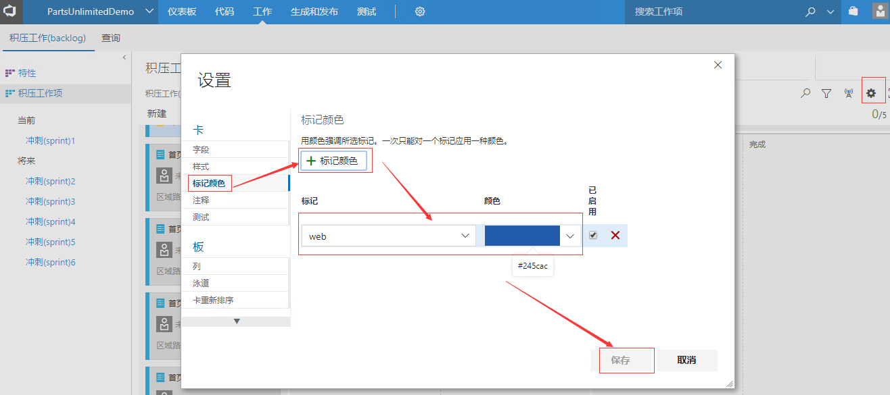
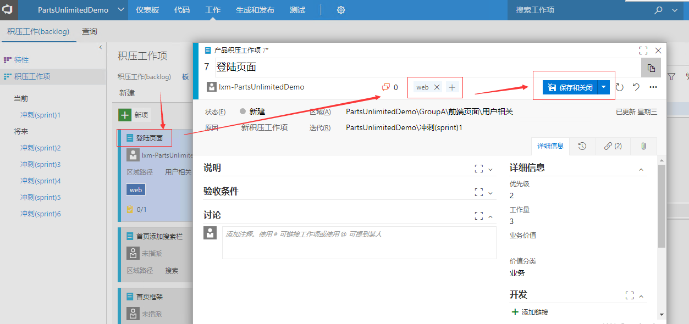
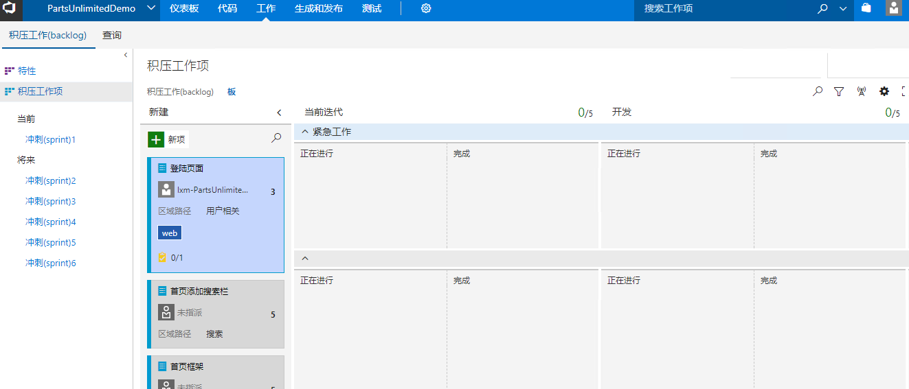

03：电子看板定制化配置
======================

本练习使用Team Foundation Server 2017，团队项目使用标准Scrum模板。

在练习中，学员将学会使用TFS 2017的看板功能管理迭代，并学会如何配置看板

TFS
2017的看板中可以通过对列，泳道，展示样式及卡片等内容进行定制，使TFS看板具有更强的展示效果与可操作性。

1.  转到团队的 \*\* 积压工作(backlog)\*\* 页并打开 **看板** 。
    团队项目的所有参与者都可以使用看板更新工作状态。

2.  此时我们可以看到kanban中共有四列，对应着backlog积压工作项的4个状态，分别是新建、已批准、已提交、完成。当前所有的工作项都处于新建状态，每个工作项都是用一个小卡片表示。小卡片上当前显示工作项的标题和被指派的团队成员，我们也可以自定义工作项卡片上显示的字段，将我们所关心的内容字段显示在卡片上。点击kanban右上角的
    **齿轮** 图标，进入看版设置窗口，点击左侧的 **字段** 标签，然后点击
    **附加字段** 下的 **字段** **+** ，在出现的 **下拉框**
    中选择想要在卡片上显示的字段。我们可以添加字段 **Area Path**
    （区域路径）字段，同时勾选下侧的
    **检查是否想要显示字段(即使字段为空)**
    ，这样不管字段有没有值都会显示在卡片上。

3.  回到kanpan视图，可以看到此时卡片上已出现了 **Area Path**
    字段。下面在 **设置** 窗口中添加看板列 当前迭代、发布，修改现有列
    已批准 \--\> 开发， 已提交 \--\> 测试。

4.  将看板列\**开发、测试*\* 与 **发布** 拆分为 **正在进行** 和
    **已完成**

5.  可以根据需求的分类或者紧急程度配置泳道，比如：这里我们添加一个新的泳道：紧急工作

6.  为了增强看板的可读性我们可以配置卡片样式，这里我们添加一些，比如：没有指派的卡片显示为黑色，指派的显示为彩色

7.  定制标签颜色

8.  为工作项添加标签

