04：使用电子看板运作一个迭代
======================

### 团队介绍

团队组成：

产品负责人： 1名 Scrum Master： 1名（团队成员轮流兼任） 开发团队成员：
8名（5开发，3测试） 迭代周期：2周，10个工作日
团队平均速率：100（每个迭代完成100工作量的积压工作）

注：在敏捷团队创建之初，确定一个迭代的周期对于敏捷团队是最重要的。
迭代周期不是越短越好，迭代周期的选定包含很多要素：

团队能交付一定量的产品增量
产品负责人能承诺的不改变已经进行计划的积压工作的最长时间 测试资源
其他因素 Scrum事件发生时间：
迭代计划会议：迭代第一个工作日上午召开（星期二 9：30 ）
每日站立会议：每日早上9：45到10点
迭代评审会议：迭代最后一个工作日下午召开
（星期一），选在周一下午召开是因为我们有一个周末的时间可以处理紧急问题
迭代回顾会议：迭代最后一个工作日下午评审会议完成后召开（星期一）

看板样式如下：

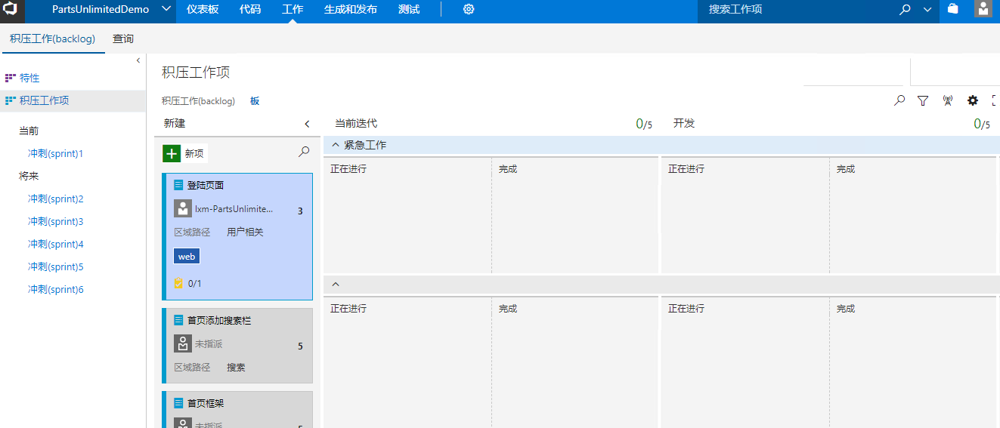

这里对我所使用的看板进行一下简单说明：

采用6列：新建，当前迭代（会在迭代计划会议中将本迭代需要完成的PBI和Bug放入此列），开发，测试，发布（此列可选），完成。
其中当前迭代对应状态New，
开发对应状态Approved，测试与发布对应状态Committed。
关于WIP，当前迭代列为每个迭代的平均完成积压工作数量；开发、测试列的WIP采用资源数\*2-1的方法来计算，比如：开发WIP为
5（开发人员)\*2-1 = 9。
采用Bug与PBI双泳道，并且Bug泳道在PBI泳道之上。我这样设计是为了说明Bug的处理优先级应该高于PBI，处于当前迭代下游的开发人员，应该优先解决当前迭代列中的Bug。在显示效果上也更醒目。
启动在开发、测试与发布列中的缓冲区，就是每个列下面的Doing和Done。因为大家都知道在看板中是采用拉动式生产方式，团队成员应该从自己所处列的上游拉取卡片到自己的工作列中。因此我们在TFS配置中启动列的缓冲区，这样可以明确的告知我们的下游团队成员哪些卡片使能够被拉取。比如：如果开发列中的卡片处于Done中，那么表示开发工作已经完成，测试人员可以对这些PBI或者Bug进行测试。

### 启动一个迭代

在迭代计划会议开始之前我们的产品负责人一定要提前整理好团队积压工作列表，包括录入积压工作及按照商业价值／紧迫程度为积压工作排序。这部份工作一定要在开始迭代计划会议之前完成，不然会大大的降低会议效率。

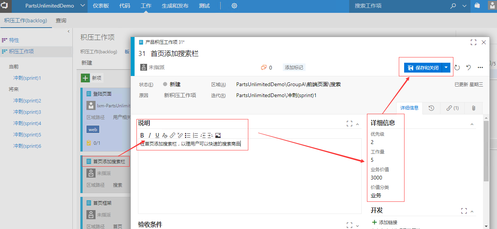

### 迭代计划会议

最左侧是由产品负责人整理的积压工作列表，优先级由上到下。那下面我们要确定这个Sprint我们要完成哪些工作：

1.  先由产品负责人将最顶的积压工作拖拽到 当前迭代中，并设置字段 迭代路径

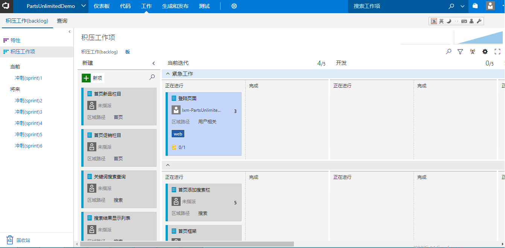

2.  开发团队对工作量进行预估，同时让团队成员认领积压工作。关于工作量也多说两句：工作量与工时是量化完成工作的两个维度。工时很好理解就是完成积压工作需要耗费的单位时间，工作量是一个没有单位的数值，预估的方式为：在积压工作列表中选取一个最简单的积压工作，然后将工作量预估为1，其他的积压工作的工作量与这个相比较。
    工作量数值一般采用近似于斐波那契数组的值：1，3，5，8，13，20，40，60，100。在TFS中工作项的工作量在积压工作项中设置，而所需工时需要在由积压工作项分解出的任务中设置。

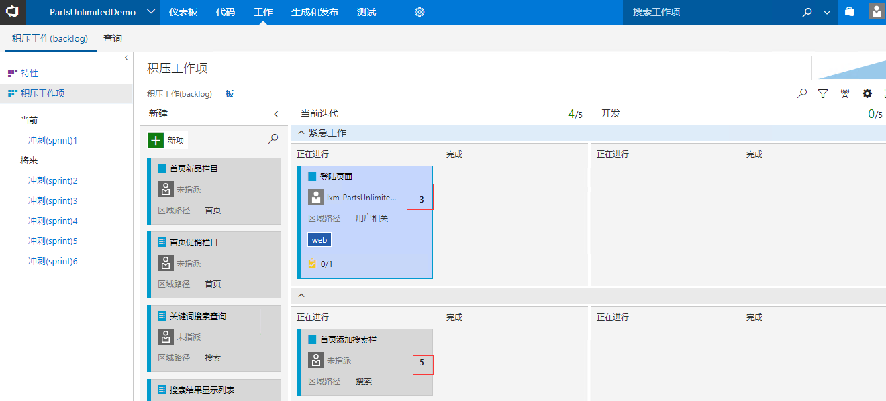

3.  与产品负责人一同确定验收标准

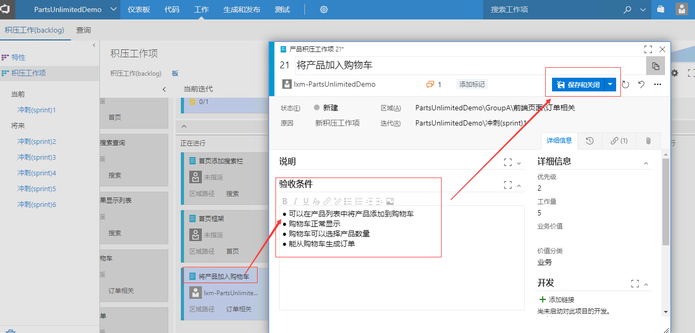

4.
按照优先级依次将新建的积压工作项拖拽到当前迭代列，直到积压工作项的工作量达到饱和。
关于开发团队每个迭代的工作量总和可以通过TFS的Sprint
速率报表（Velocity）查看以往迭代的完成速率来确定。

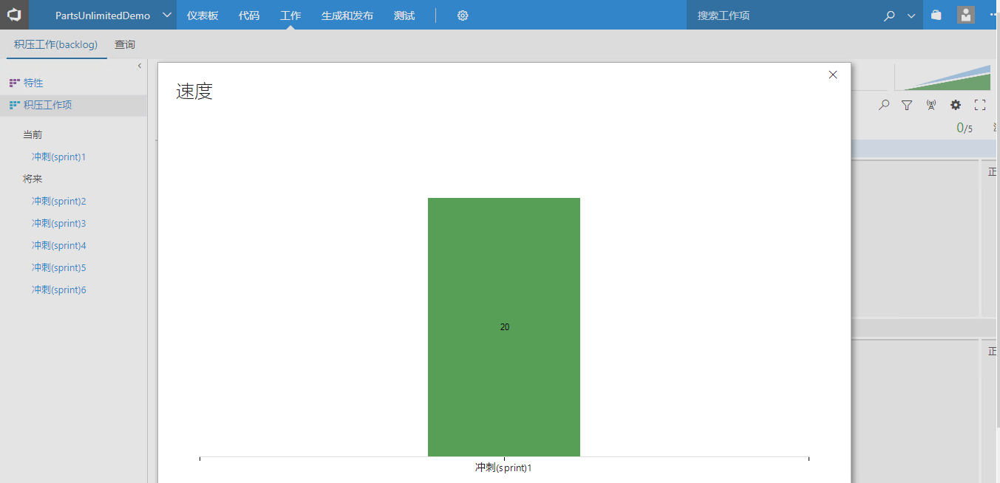

5.  确定如何完成这些积压工作。细化需求，将积压工作项分解为任务。如果一个积压工作不能在一天内完成，我们又想知道每天的工作进度，可以将积压工作分解为任务，通过任务来跟踪团队成员每日的工作情况.

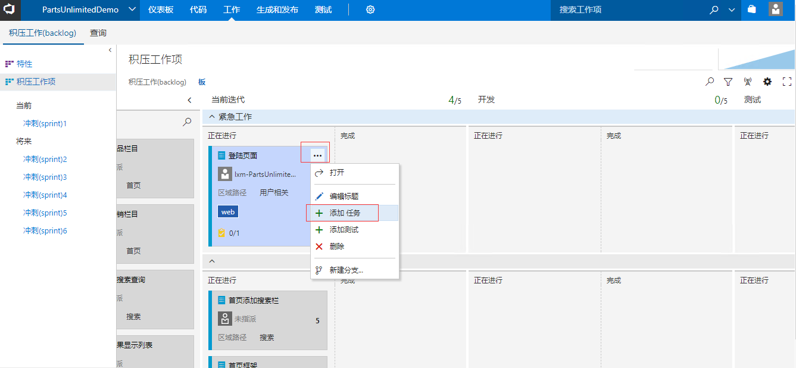

### 每日站立会议

按照先开发人员再测试人员的顺序，每个团队成员只需要回答3个问题：

1.  昨天做了什么？ 完成了哪个积压工作或者任务。 如果积压工作完成，将积压工作从开发拖入到测试正在进行中

    :   -   如果该团队成员完成了工作，将卡片从当前列的 **正在进行**
            移动到 **完成** ，表示此工作在当前阶段已经完成。

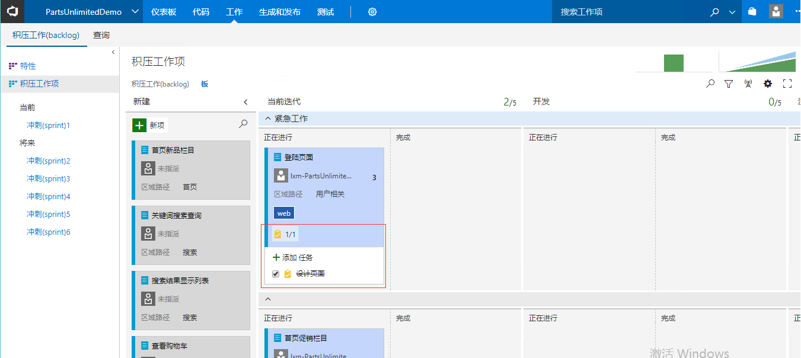

2.  今天要做什么？该团队成员只需要从自身角色所在流程的上游获取新的卡片即可，比如开发人员在当前迭代中拉取新的PBI或者Bug到开发列的Doing中；测试人员将开发列Done中的PBI拖拽到测试的Doing进行测试
3.  遇到了哪些问题？千万不要在站立会议上寻求问题的解决方案，这会占用团队的大量时间，只需要告诉大家你有什么问题就可以了。

如果我们每个列的卡片过多，每个团队成员在站立会议过程中只想展示自己的卡片怎么办？可以使用看板中的快速搜索功能

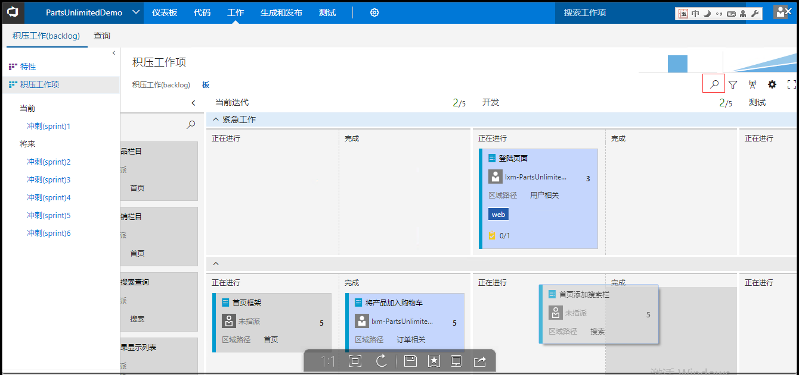

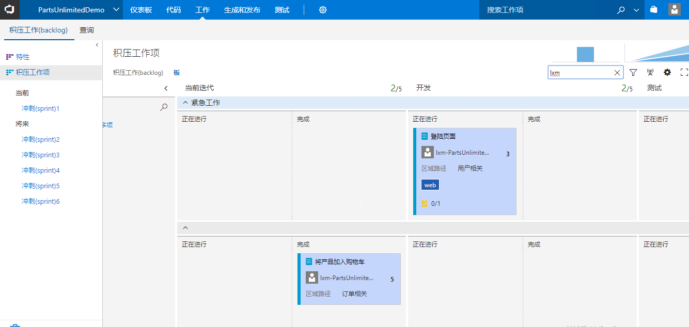

### 迭代评审会议

向产品经理交付在测试完成列中的积压工作，不在新建与发布列Done列中的其他工作项当前Sprint未完成积压工作。
根据接受标准向产品负责人展示交付物，如果产品负责人接受交付，将积压工作项拖入完成列。
如果产品负责人不接受，开发团队同意下个迭代进行修改，可以添加标签注明是哪个迭代的积压工作，并在下个迭代计划会议中将积压工作项拖拽到当前迭代中

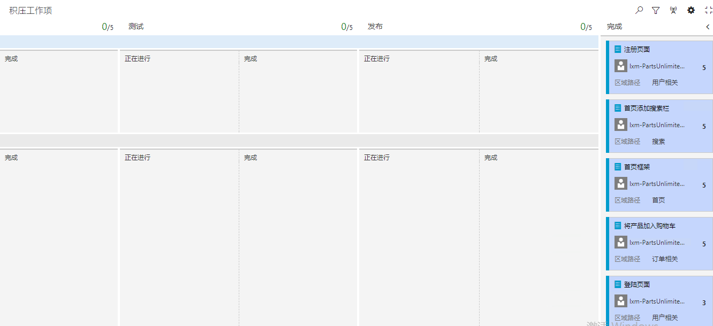
