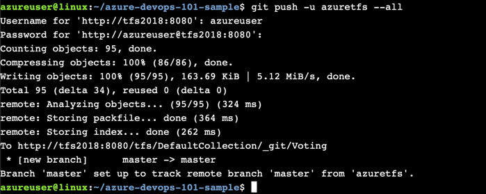

# 01 从Github导入源代码到Azure DevOps Repo代码托管
#### 通过此练习您将学习如何将Git库代码导入到Azure DevOps Server配置管理系统.
## 1.	打开Linux服务器

## 2.	执行克隆命令，克隆存储在github的示例代码，命令如下：
##### git clone https://github.com/leansoftX/TechSummit2018Demo.git

## 3.	进入示例代码文件夹 “TechSummit2018Demo”，命令如下：
##### cd TechSummit2018Demo

## 4.	添加Git远程服务器
##### git remote add azuretfs http://tfs2018:8080/tfs/DefaultCollection/_git/TechSummit2018

## 5.	提交代码到Azure DevOps Server配置管理系统，命令如下：
##### git push -u azuretfs –all
## 6.	输入账号密码（用户名：azureuser，密码：P2ssw0rd@123）

## 7.	代码提交完成，回到Azure DevOps代码管理界面， 如下图所示：

#### 恭喜，您已经成功将代码导入到Azure DevOps Server配置管理系统，在下一个练习我们将完成Azure DevOps Server的持续集成搭建。