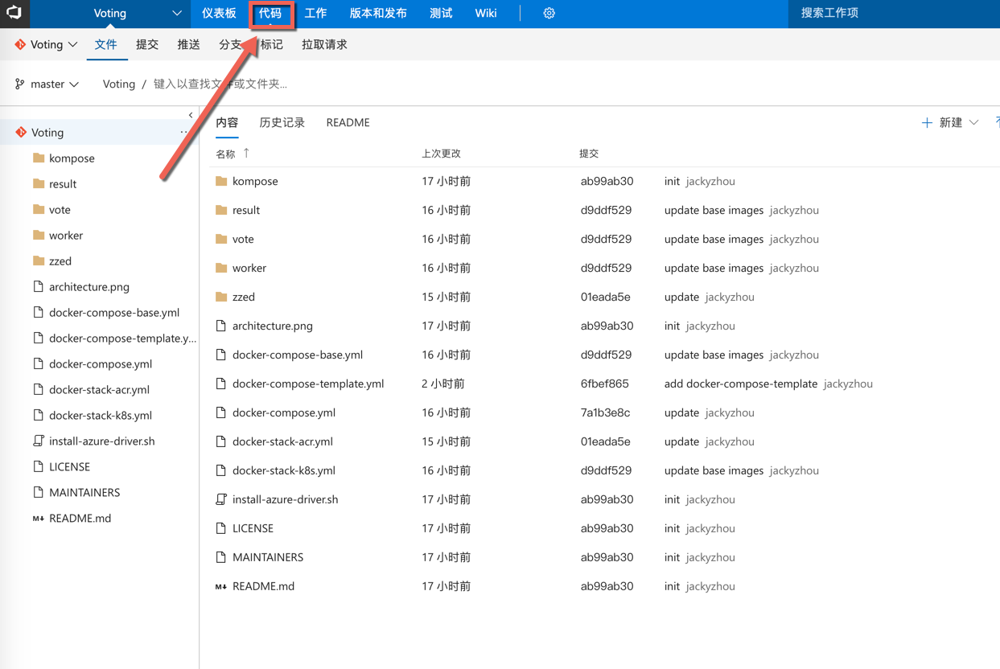

# 01 从Github导入源代码到Azure DevOps Repo代码托管
#### 通过此练习您将学习如何将Git库代码导入到Azure DevOps Server配置管理系统.
## 0. 准备工作
#### 请大家参考[创建Azure DevOps 项目](../../labs00-environment-preparation/index.md#创建Azure_DevOps_项目)来创建我们接下来实验中要用到的Azure DevOps “Voting” 项目，如果已经创建完毕请忽略此部分。

## 1. 打开DevOps魔盒：http://devcloudx.com, 使用账号密码登录系统

## 2. 点击“环境模版” | “TFS2018生产环境“，查看“已激活”的环境列表

## 3. 选择可用环境，点击进入

##### 当前页面列出了Azure DevOps Server的环境信息，包括服务器地址，用户名密码等信息，也可以直接通过此页面进行环境管理（开机、关机、销毁等操作）

## 4. 打开Linux服务器

## 5. 执行克隆命令，克隆存储在github的示例代码，命令如下：
##### git clone https://github.com/leansoftX/azure-devops-101-sample.git

## 6. 进入示例代码文件夹 “azure-devops-101-sample”，命令如下：
##### cd azure-devops-101-sample

## 7. 添加Git远程服务器
##### git remote add azuretfs http://tfs2018:8080/tfs/DefaultCollection/_git/Voting

## 8. 提交代码到Azure DevOps Server配置管理系统，命令如下：
##### git push -u azuretfs --all

## 9. 输入账号密码（用户名：azureuser，密码：P2ssw0rd@123）

## 10. 代码提交完成，回到Azure DevOps代码管理界面， 如下图所示：

#### 恭喜，您已经成功将代码导入到Azure DevOps Server配置管理系统，在下一个练习我们将完成Azure DevOps Server的持续集成搭建。