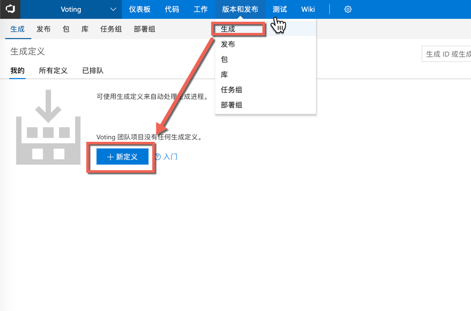
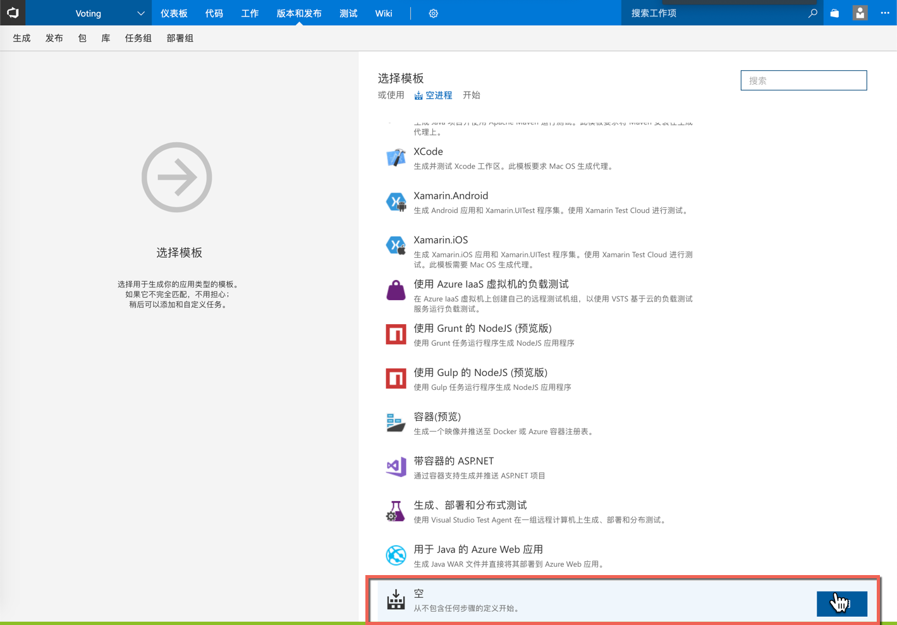
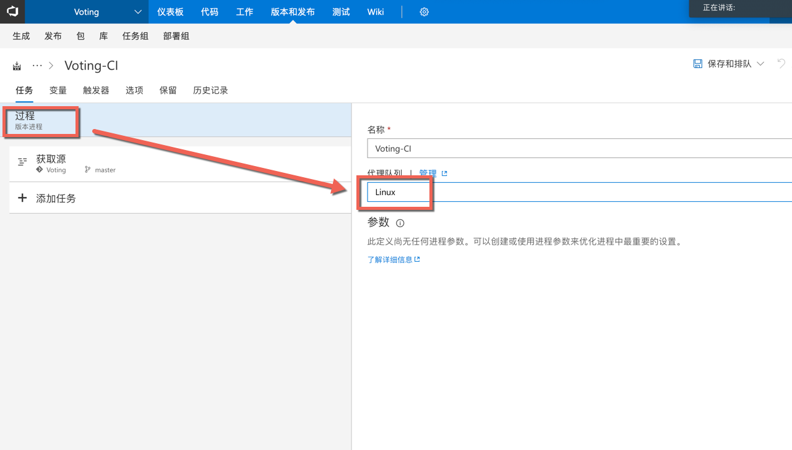
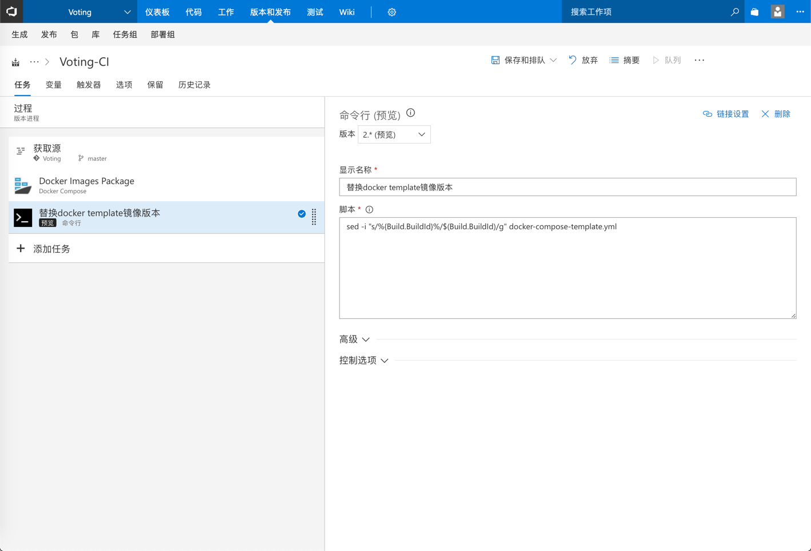
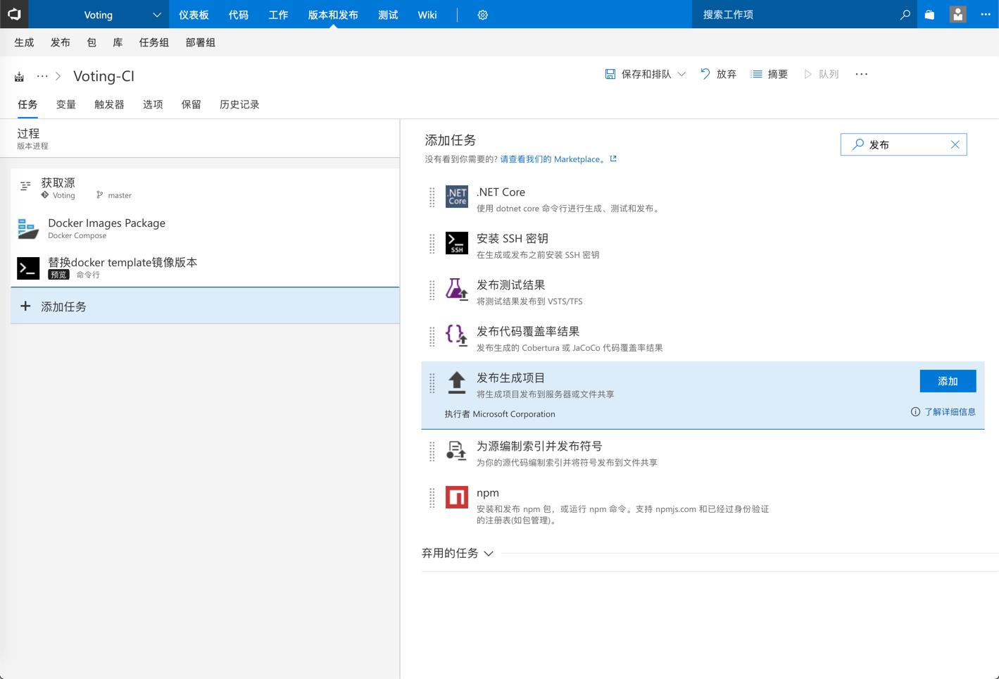
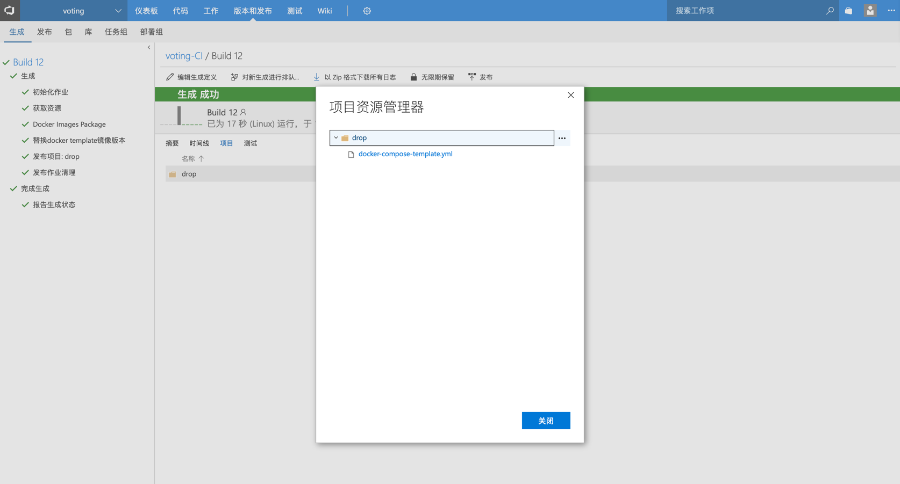

# 02 使用 Azure DevOps Pipeline流水线完成持续集成配置（生成定义）
#### 通过此练习您将学习如何通过Azure DevOps Server配合Docker 快速搭建.Net Core应用程序的持续集成完成应用的编译打包。
## 创建构建定义
### 1.	点击 “版本和发布” | “生成” | “新定义”

### 2.	选择空模版，点击应用

### 3.	设置代理队列为 “Linux” （此代理已预装docker）

### 4.	构建步骤一：使用Docker命令编译应用并打包镜像
##### 添加任务，搜索“命令行“，点击“添加” 

##### 请按照如下表格设置参数：
|参数|值|说明|
|-|-|-|
|版本：|2*（预览）|命令行版本|
|显示名称：|使用docker编译应用|构建步骤显示名称|
|脚本：|docker build -f ./TechSummitDemo/Dockerfile -t techsummitdemo:$(Build.BuildId) .|使用docker build命令编译并打包镜像|
|高级/工作目录：|TechSummitDemo|设置docker脚本的工作目录|

### 5.	构建步骤二：使用Sed命令替换docker编排文件镜像版本
##### 添加任务，搜索“命令行“，点击“添加” ，请按照如下表格设置参数：
|参数|值|说明|
|-|-|-|
|版本：|2*（预览）|命令行版本|
|显示名称：|更新镜像版本|构建步骤显示名称|
|脚本：|sed -i "s/%{Build.BuildId}%/$(Build.BuildId)/g" docker-compose-template.yml|使用sed命令替换docker-compose-template编排文件的部署镜像版本|
|高级/工作目录：|TechSummitDemo|设置docker脚本的工作目录|

### 6.	构建步骤三：复制docker编排文件到构建发布文件夹
##### 添加任务，搜索“复制文件“，点击“添加” ，请按照如下表格设置参数：
|参数|值|说明|
|-|-|-|
|版本：|2*（预览）|命令行版本|
|显示名称：|将文件复制到$(Build.ArtifactStagingDirectory)|构建步骤显示名称|
|源文件夹：|TechSummitDemo|复制源文件夹|
|内容：|docker-compose-template.yml docker-compose.override.yml|复制文件列表|
|目标文件夹：|$(Build.ArtifactStagingDirectory)|预发布文件夹|
|高级/覆盖|勾选|覆盖目标文件|

### 7.	构建步骤四：回传发布文件到Azure DevOps Server
##### 添加任务，搜索“发布”，选择“发布生成项目“ 点击添加，如下图所示：

##### 请按照如下表格设置参数：
|参数|值|说明|
|-|-|-|
|显示名称：|发布项目:drop|构建步骤显示名称|
|要发布的路径：|$(Build.ArtifactStagingDirectory)|发布文件夹|
|项目名称：|drop|设置文件夹名称|
|项目类型：|Server|回传到Azure DevOps Server|

## 触发持续集成
### 1. 点击 “保存和排队

### 2. 点击“队列”

### 3. 点击#1，查看生成结果，如下图所示：

### 4. 查看生成步骤：
##### Note：构建过程可能需要5～7分钟，建议大家在这段时间回顾下上面的练习。

### 5. 构建完成，如下图所示，点击Build1 查看发布结果

### 6. 点击 “项目” | “浏览” 查看发布结果

##### Note：这里我们发布的包含最新镜像版本的docker-compose编排文件

##### 在linux服务器中输入 docker images查看持续集成打包好的镜像文件：

#### 恭喜，您已经成功完成了持续集成的搭建，持续集成的输出结果是打包好的镜像和yml编排文件，此镜像和yml文件将作为下一步持续部署的输入元素,在下一个练习将完成持续部署的搭建