# 03 使用 Azure DevOps Pipeline流水线完成持续部署配置（发布定义）
#### 通过此练习您将学习如何通过Azure DevOps Server搭建项目快速交付流水线，完成.net core 项目的自动化部署。
## 创建发布定义
### 1. 点击 “版本和发布“，选择“发布”
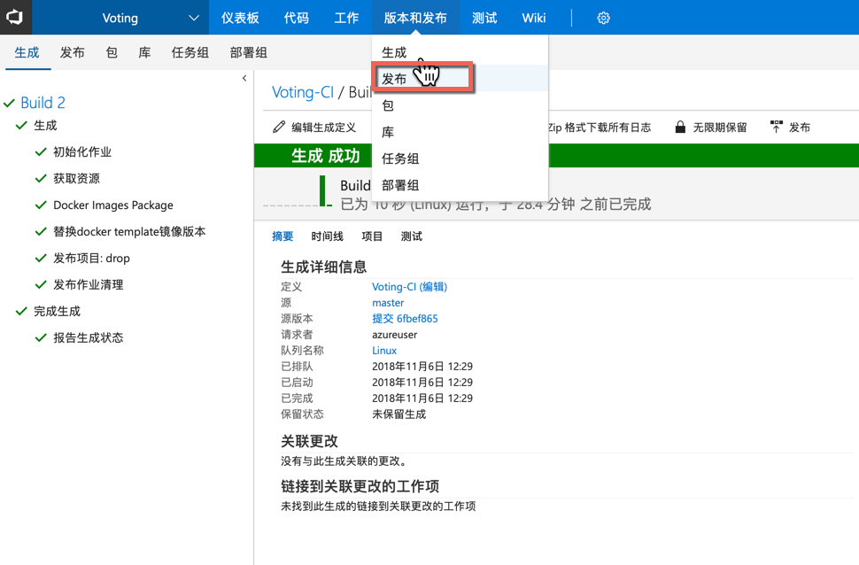
### 2. 点击 “新建定义”
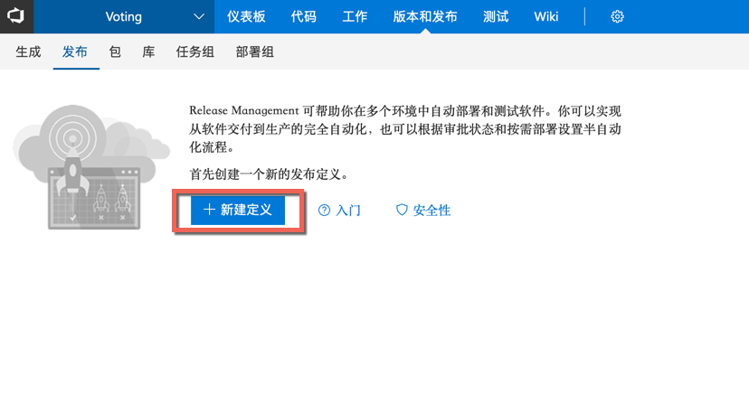
### 3. 选择“空” 模版 点击应用
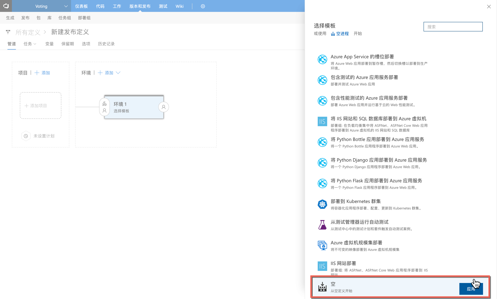
### 4. 点击 “添加项目” ，选择源（生成定义）“TechSummit2018-CI”，点击添加

### 5. 修改环境名称为 “DEMO环境”
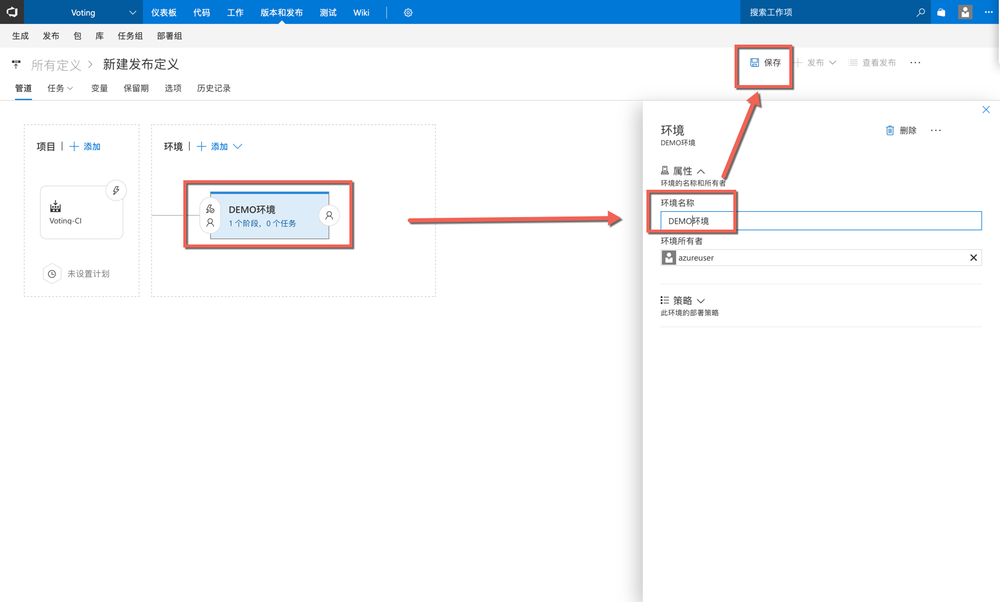
### 6. 点击环境的步骤任务
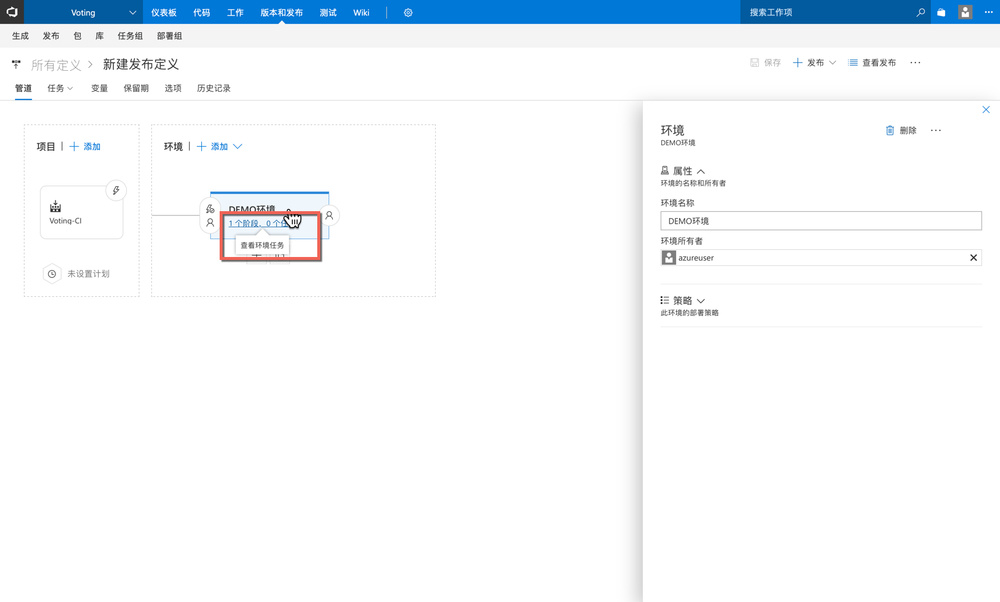
### 7. 设置代理阶段为 “Linux”
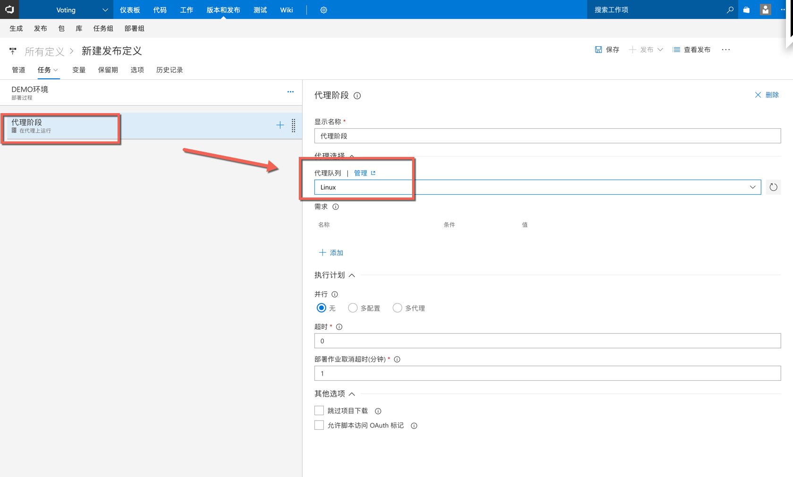
### 8. 添加部署步骤：点击+，搜索“命令行”，点击“添加”

### 9. 请按照如下表格设置参数：
|参数|值|说明|
|-|-|-|
|版本|2||
|显示名称：|使用容器运行应用|构建步骤显示名称|
|脚本：|docker-compose -f docker-compose-template.yml -f docker-compose.override.yml -p demo up -d|使用docker compose命令执行环境部署|
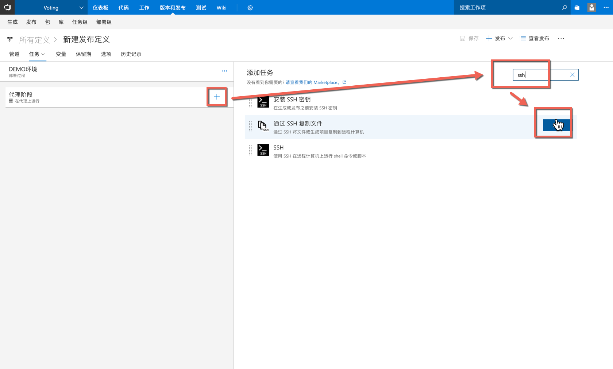
### 10.	打开 “高级” | “工作目录”，设置工作目录，如下图所示：

### 11.	修改发布定义名称为“TechSummitRelease” ，并点击“保存”

## 触发持续部署
### 1. 点击“发布”| “创建发布”

### 2. 点击“排队”
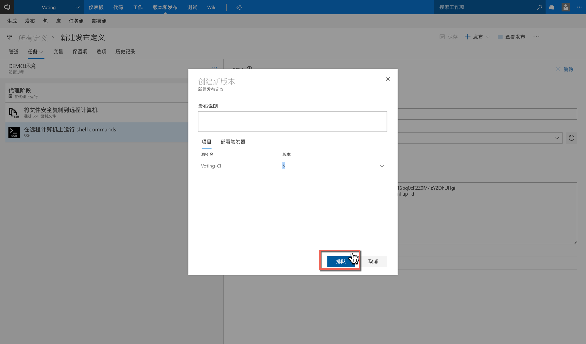
### 3. 点击“Release-1” 查看发布日志：

## 查看发布后的站点
### 1. 打开Linux Server，点击5000端口，如下图所示：

### 2. 站点部署成功，如下图所示：

## 启动持续编译
### 1. 点击“版本和发布” | “生成”

### 2. 编辑生产定义

### 3. 点击 “触发器” | 触发器状态设置为 “已启用” | 点击保存

### 4. 点击保存

## 启动持续发布
### 1. 点击 发布 | TechSummitRelease | 编辑
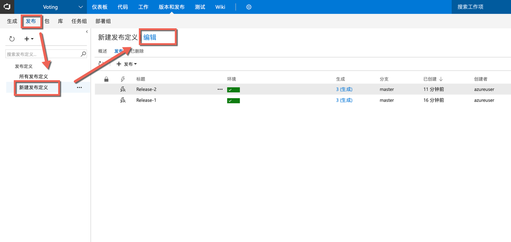
### 2. 启动 “持续部署触发器”| 保存

## 验证持续发布
### 1. 修改master代码代码，验证持续发布

### 2. 修改代码，点击提交
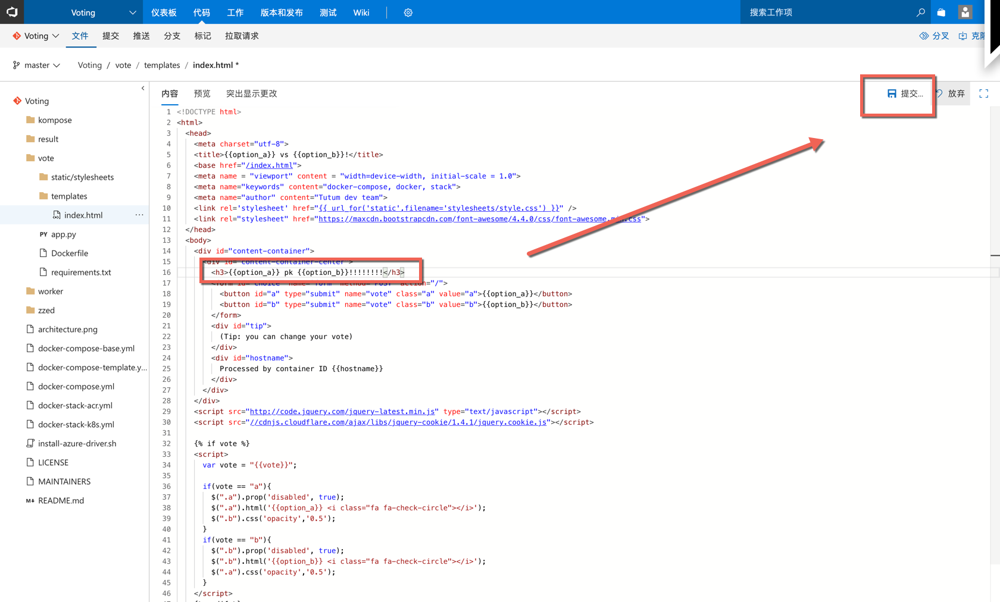
### 3. 点击“提交”
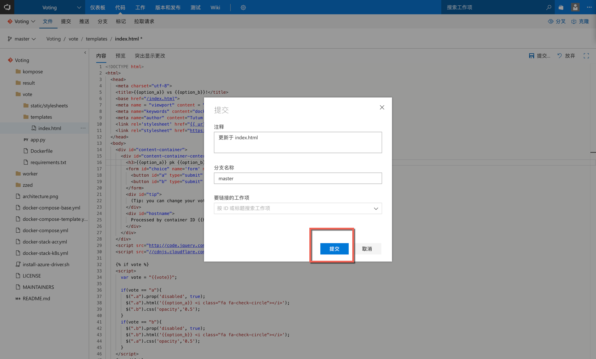
### 4. 点击“版本和发布” | “生成“ | 查看生成进度

### 5. 查看部署结果

### 6. 刷新应用页面，查看结果

#### 恭喜，您已经成功完成了持续部署的搭建