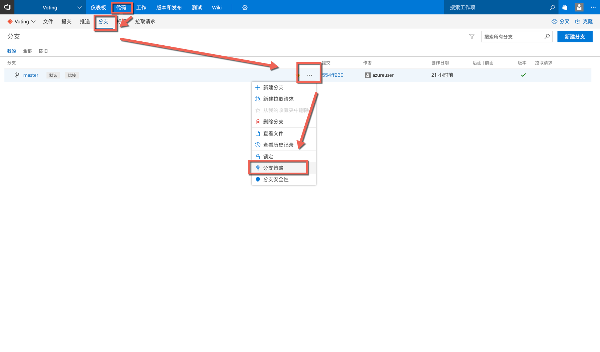
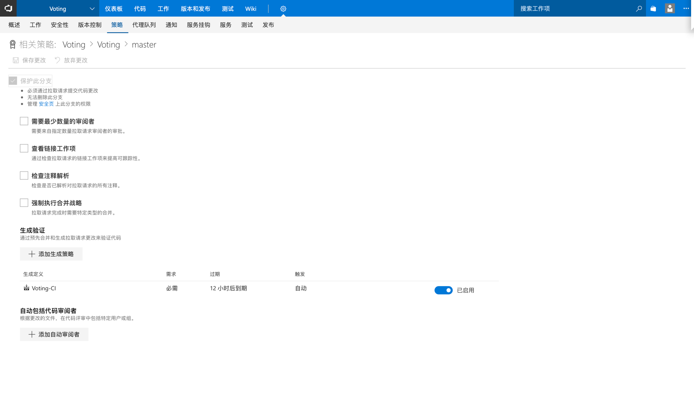
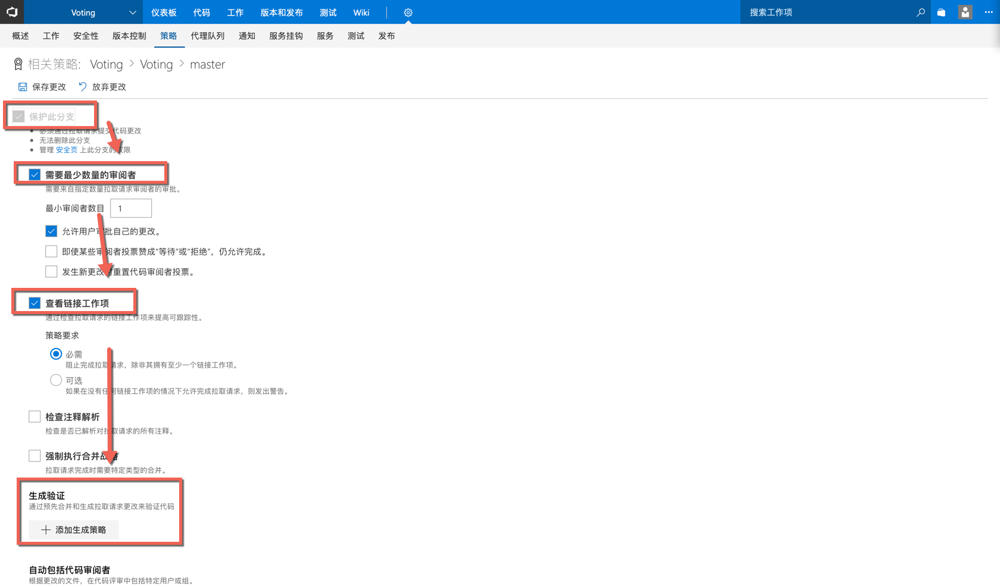
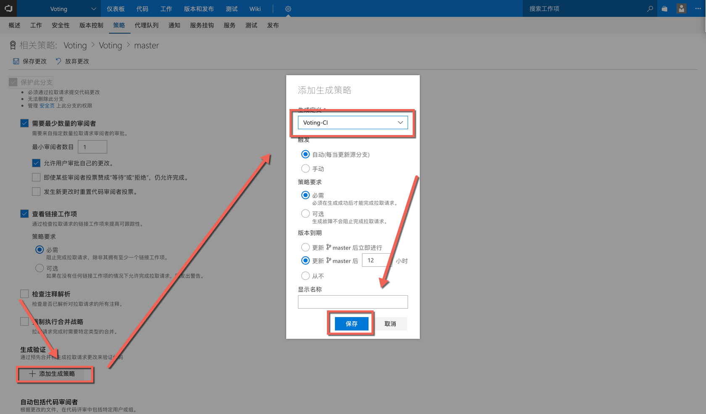
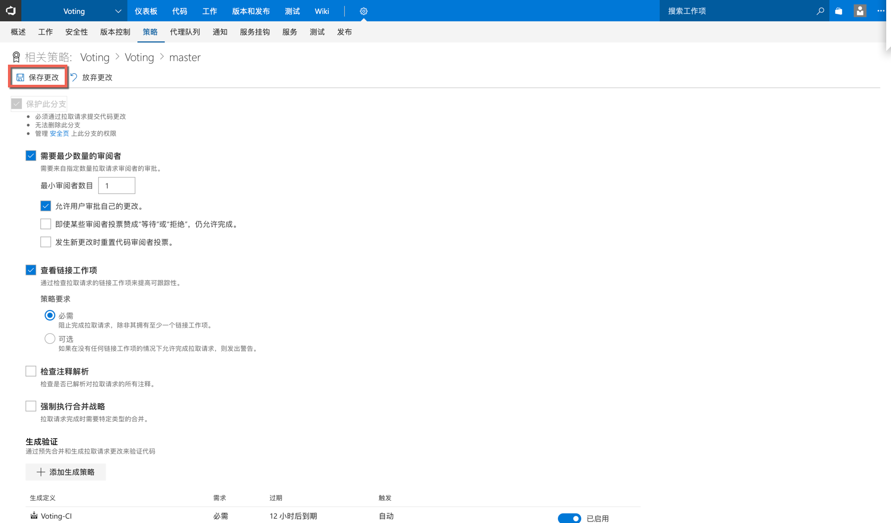

# 01 启用分支保护
##### 通过在master分支上启动分支保护, 通过一系列的策略实现对代码变更的控制以实现保护特定分支，控制进入分支的代码质量的目的，一旦启用以上任何策略，将不再允许直接向受保护分支提交代码变更.

## 1.点击“代码”| “分支”| master | “分支策略”

## 2. 细说分支策略

|策略|说明|
|-|-|
|需要最少数量的审阅者|<ul><li>在拉取请求完成之前必须有多少人提供了审阅意见(投票)</li><li>是否允许通过自己的修改</li><li>是否允许在有人投反对/等待的时候完成拉取请求</li><li>代码变更时是否重置投票结果</li></ul>|
|查看链接工作项|<ul><li>关联工作项有助于审阅者了解变更的原因</li><li>可以帮助团队增强跟踪能力</li></ul>|
|检查注释解释|<ul><li>要求所有意见都关闭有助于防止遗漏问题处理</li><li>让评审记录本身成为任务列表</li></ul>|
|强制执行合并战略|<ul><li><b>无快进合并</b> 因为快进合并将重写目标分支的历史记录，如果希望保持原有的分叉模式，则可以选择这种方式。</li><li><b>Squash 合并</b> 在合并到目标分支的时候将原分支的所有提交合并为一个, 这将减少目标分支上的变更数量，有时我们并不希望看到所有的提交。比如：如果误将密钥等信息写入了特性分支，则采用这种模式将抹除这个提交记录，密钥也将不会出现在历史记录中。</li></ul>|
|生成验证|<ul><li>持续集成代理将同时获取当前特性分支和目标分支代码，并将特性分支合并到目标分支上，然后执行持续集成任务，确保当其他人更新了目标分支时内容不会被遗漏。</li><li>持续集成中所加入的各种静态代码检查，自动化单元测试等均成为当前拉去请求合并规则的一部分。</li><li>如果连接了持续部署，则于当前拉去请求变更内容一致的测试环境将被创建，加速测试与开发的迭代速度。</li></ul>|
|添加自动审阅者|<ul><li>根据团队成员对不同路径下的代码(模块)的熟悉程度，要求特定路径下代码必须由特定人员进行审阅。</li><li>符合规则的审阅人将被添加为“必须审阅者”，必须审阅者必须进行投票，即使最小审阅者数量已经达到。</li></ul>|

## 3. 启动以下策略

## 4. 保存更改
