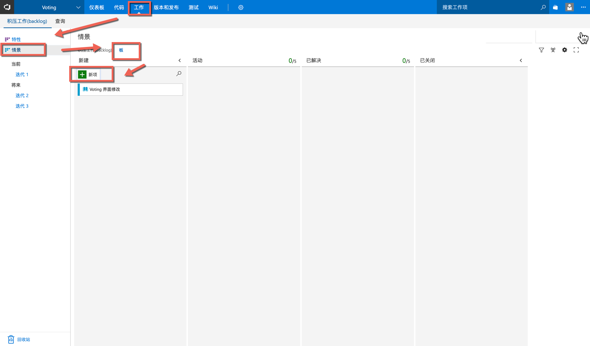
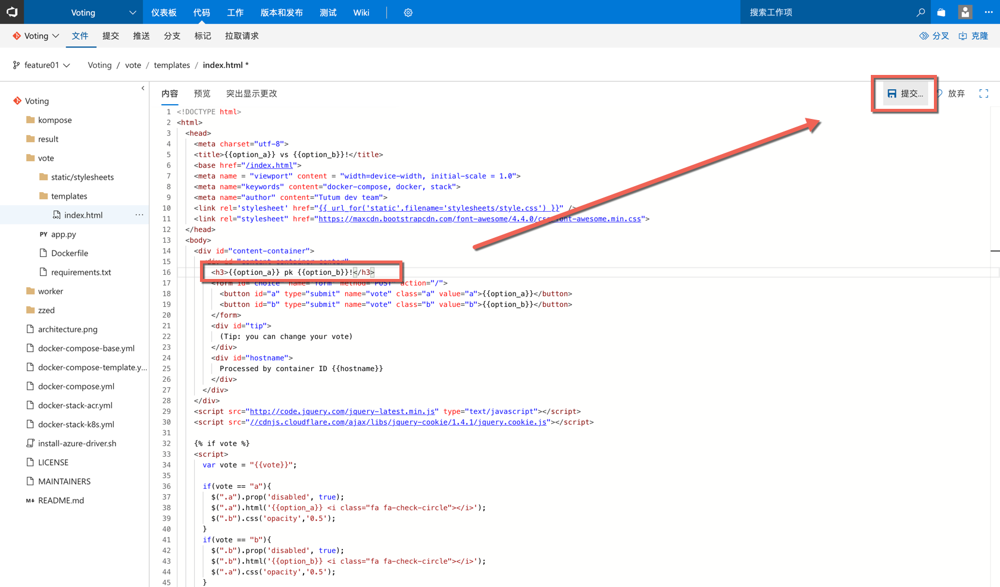
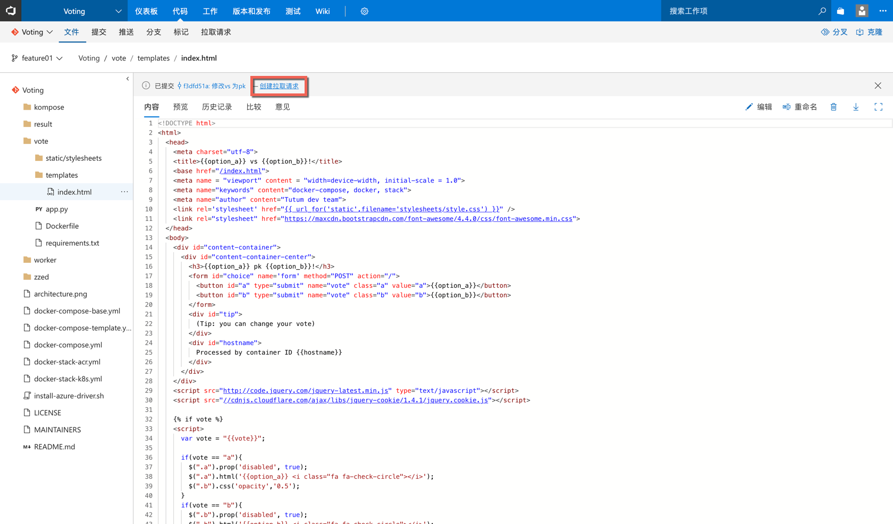
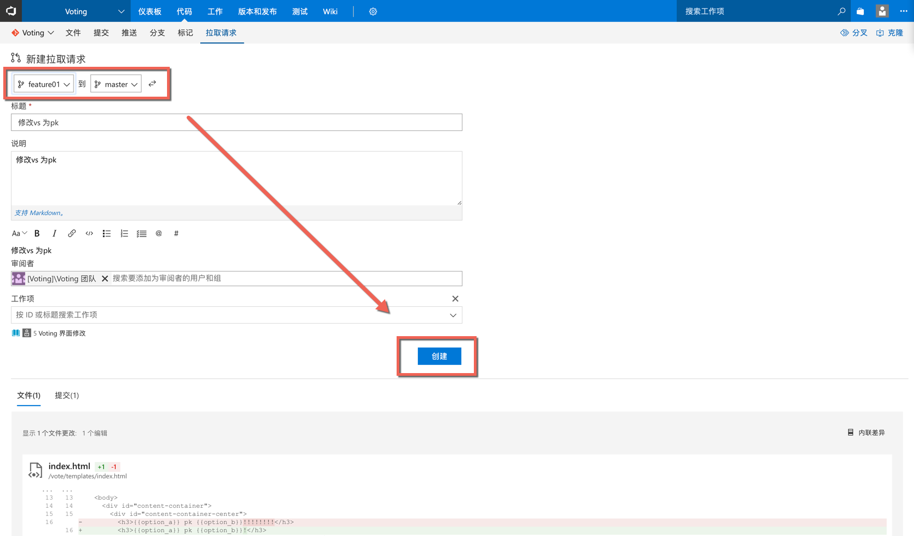
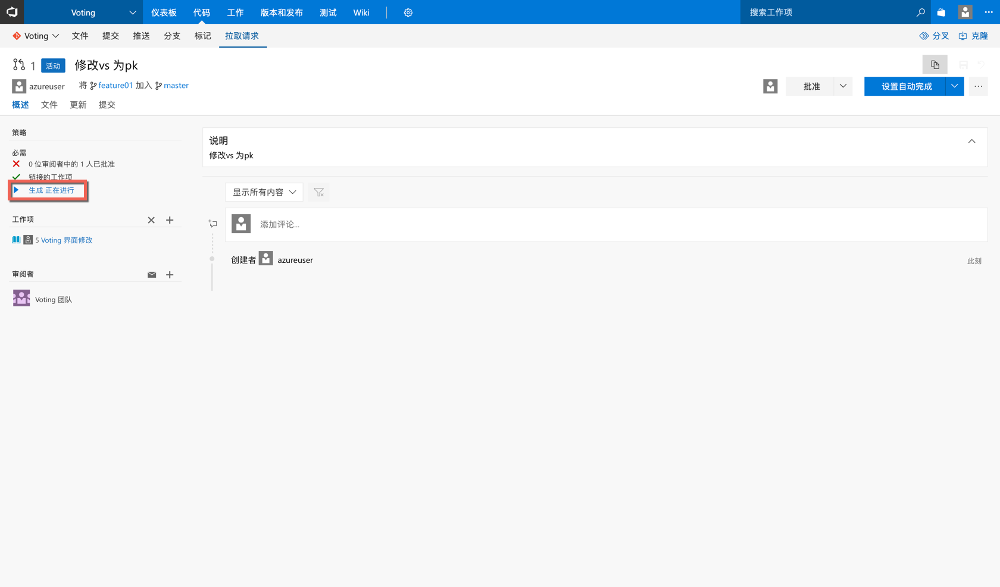

# 02 创建功能分支并使用拉取请求完成质量验证
## 创建功能分支
### 1. 添加需求 – “Voting 界面修改”

### 2. 点击 “...”| “新建分支”

### 3. 输入分支名称 “feature+需求编号”，如下图所示：

### 4. 在线修改代码：文件 | feature01 | index.html | 编辑

##### 修改第16行代码，点击提交

### 5. 添加代码注释 “修改vs 为pk”，点击提交

## 创建拉取请求

### 1. 点击 “创建拉取请求”

### 2. 确认是从“feature01”到“master”并点击“创建”

### 3. 生成验证已启动，点击查看

### 4. 查看持续部署已启动

### 5. 查看持续部署已完成

### 6. 查看功能已上线

