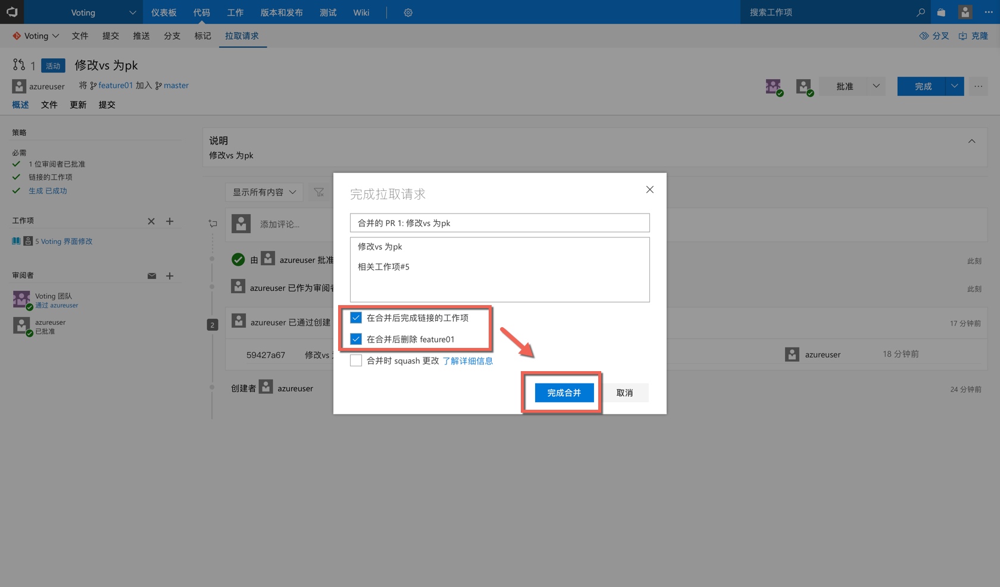

# 03 完成拉取请求以便合并代码到master分支

## 1. 点击 “代码”|“拉取请求”|“修改vs为pk”

## 2. 查看策略必须项完成情况，并点击“批准”

## 3. 再次查看策略必须项完成情况，并点击“完成”

## 4. 确认是否需要“合并后完成链接的工作项”和“合并后删除feature01”，点击“完成合并”

## 5. 拉取请求合并完成

#### 恭喜你已经完成了所有的训练！